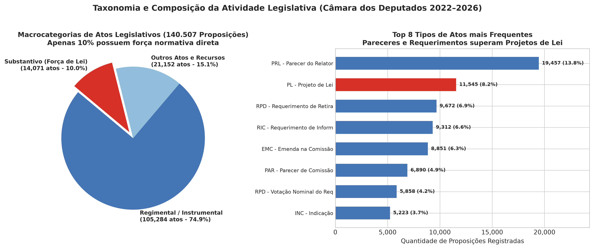
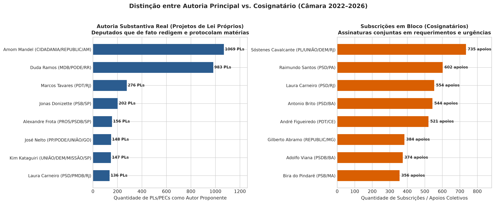
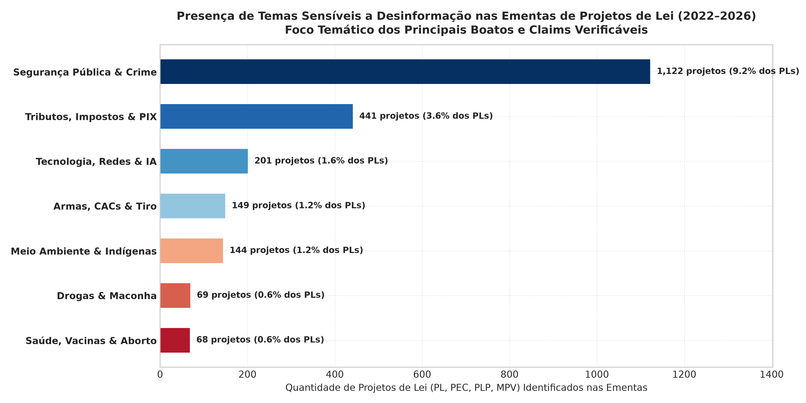
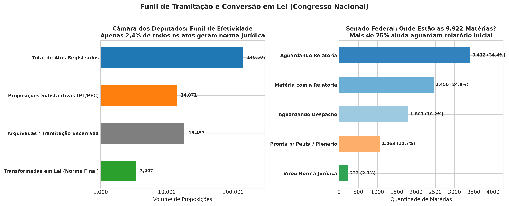
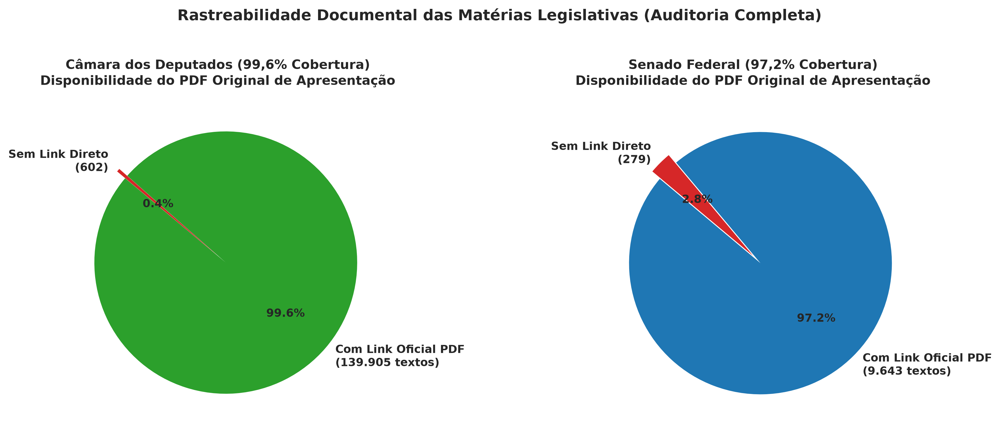

# Relatório de Análise Exploratória de Dados (EDA)
# Eixo 3: Atividade Legislativa, Autoria e Tramitação (Câmara dos Deputados & Senado Federal)
**Base de Conhecimento e Tooling para Chatbot Agêntico de Fact-Checking Político**

---

## 1. Resumo Executivo e Contexto para o Fact-Checking

No debate público e nas redes sociais, alegações legislativas figuram no centro de narrativas políticas polarizadas. Casos clássicos incluem:
*   *"O deputado Fulano é o autor da lei que proibiu/criou X."* (Falsa autoria ou atribuição indevida a quem foi apenas coautor secundário).
*   *"O Congresso aprovou o fim do PIX / taxação da internet / liberação de armas."* (Confusão entre um Projeto de Lei recém-protocolado e uma Lei já sancionada).
*   *"O parlamentar Y é o mais produtivo do Brasil, com 800 propostas no mandato."* (Inflação estatística somando simples requerimentos protocolares a projetos de lei reais).

Esta Análise Exploratória de Dados (EDA) investigou as bases integradas de **Proposições e Autoria da Câmara dos Deputados** e **Matérias Legislativas do Senado Federal** no período de **2022 a 2026**:

| Base Analítica | Total de Registros | Período | Principais Metadados | Tamanho Parquet |
| :--- | :---: | :---: | :---: | :---: |
| **Câmara — Proposições** | 140.507 | 2022–2026 | Tipo, Ementa, Status, Despacho, URL do PDF Original | ~18,2 MB |
| **Câmara — Autores** | 456.351 | 2022–2026 | ID Deputado, Partido, UF, Ordem de Assinatura, Proponente | ~12,5 MB |
| **Senado — Matérias** | 9.922 | Histórico/Vigente | Identificação, Ementa, Autoria, Situação, Norma Gerada | ~0,87 MB |
| **Total Consolidado** | **606.780** | — | **Mapeamento completo do processo legislativo federal** | **~31,6 MB** |

---

## 2. Taxonomia das Proposições: O Mito da Produtividade Legislativa

A análise das 140.507 proposições registradas na Câmara dos Deputados revelou uma assimetria estrutural profunda sobre o que realmente tramita no Congresso:

### 2.1 Apenas 10% das Proposições têm Força de Lei
*   **Atos Regimentais e Instrumentais (74,93% - 105.284 atos):** A esmagadora maioria da atividade registrada na Câmara consiste em pareceres de comissão (PRL - 13,85%), requerimentos de retirada de pauta (RPD - 11,05%), pedidos de informação ministerial (RIC - 6,63%), emendas (EMC - 6,30%) e indicações protocolares (INC - 3,72%).
*   **Outros Atos e Recursos (15,05% - 21.152 atos):** Recursos, documentos avulsos e mensagens regimentais.
*   **Proposições Substantivas / Normativas (10,01% - 14.071 atos):** Apenas 1 a cada 10 propostas consiste em um ato com força potencial de lei (PL - Projeto de Lei, PLP - Projeto de Lei Complementar, PEC - Proposta de Emenda à Constituição, MPV - Medida Provisória ou PDL - Projeto de Decreto Legislativo).
*   **Insight para o Fact-Checking:** Quando um político alega ter apresentado centenas de propostas, o chatbot agêntico deve filtrar e reportar a distinção entre atos instrumentais e **Projetos de Lei substantivos reais**, desmentindo métricas infladas de produtividade parlamentar.

---

## 3. Autoria vs. Coautoria Coletiva: O Campo Decisivo (`proponente`)

A base de autores da Câmara registra 411.537 vínculos atribuídos formalmente a deputados federais:

### 3.1 Proponente Principal vs. Cosignatário / Apoiador
*   **Autor Principal (`proponente == 1` ou `ordemAssinatura == 1`):** **71,7% (295.059 vínculos)**. Corresponde ao parlamentar que de fato concebeu, redigiu e encabeçou a proposição.
*   **Cosignatário / Subscritor (`ordemAssinatura > 1`):** **28,3% (116.478 vínculos)**. Corresponde a assinaturas coletivas de apoio, requerimentos de urgência de bancada ou subscrições em bloco.

### 3.2 Quem Realmente Escreve Projetos de Lei (Top Autores de PL/PEC/PLP):
Deputados que lideram na apresentação de proposições substantivas próprias como autores principais (consolidados por parlamentar, unificando mudanças de partido):
1.  **Amom Mandel** (CIDADANIA/REPUBLICANOS - AM): **1.069 projetos** de lei substantivos.
2.  **Duda Ramos** (MDB/PODE - RR): **983 projetos** de lei substantivos.
3.  **Marcos Tavares** (PDT - RJ): **276 projetos**.
4.  **Jonas Donizette** (PSB - SP): **202 projetos**.
5.  **Alexandre Frota** (PROS/PSDB - SP): **156 projetos**.
6.  **José Nelto** (PP/PODE/UNIÃO - GO): **148 projetos**.
7.  **Kim Kataguiri** (UNIÃO/DEM/MISSÃO - SP): **147 projetos**.
8.  **Laura Carneiro** (PSD/PMDB - RJ): **136 projetos**.

> [!NOTE]
> **Consolidação de Mandatos e Janela Partidária:**
> Ao agrupar os dados apenas por texto de partido, parlamentares que trocaram de legenda (como Amom Mandel, que migrou do Cidadania para o Republicanos, e Duda Ramos, que migrou do Pode para o MDB) apareciam duplicados em tabelas ingênuas. Na análise refinada, consolidamos pelo `idDeputadoAutor`, computando a totalidade de sua produção autoral independentemente de trocas de partido ao longo da legislatura.

### 3.3 Quem Lidera em Subscrições e Apoios em Bloco (Cosignatários):
Parlamentares atuando intensivamente na articulação de bancada, assinando requerimentos coletivos:
1.  **Sóstenes Cavalcante** (PL/UNIÃO - RJ): **735 subscrições** de apoio.
2.  **Raimundo Santos** (PSD - PA): **602 subscrições**.
3.  **Laura Carneiro** (PSD - RJ): **554 subscrições**.
4.  **Antonio Brito** (PSD - BA): **544 subscrições**.
5.  **André Figueiredo** (PDT - CE): **521 subscrições**.

*Regra de Ouro do Fact-Checking:* Se um usuário perguntar se *"o deputado X é autor do Projeto de Lei Y"*, a *tool* do agente consulta `proponente` e `ordemAssinatura`. Se a ordem for maior que 1, a resposta deve esclarecer com precisão: *"O deputado X não é o autor original do projeto; ele é o 14º signatário de apoio em uma lista de 35 deputados. O autor principal que protocolou a matéria é o deputado Z"*.

---

## 4. Mineração Temática de Ementas: Os Temas Sensíveis a Desinformação

Avaliamos a presença de termos-chave nas ementas dos **12.146 Projetos de Lei, PECs, PLPs e MPVs** em temas que rotineiramente geram alegações falsas:

| Tema de Alto Impacto | Termos de Busca Rastreados | Qtd. de Projetos | % dos PLs |
| :--- | :--- | :---: | :---: |
| **Segurança Pública & Crime** | *crime, penal, homicídio, facção, maioridade penal, presídio* | **1.122** | **9,24%** |
| **Tributos, Impostos & PIX** | *imposto, tributária, cpmf, pix, irpf, isenção fiscal, taxação* | **441** | **3,63%** |
| **Tecnologia, Redes Sociais & IA** | *internet, redes sociais, inteligência artificial, fake news, desinformação* | **201** | **1,65%** |
| **Armas, CACs & Tiro Esportivo** | *arma, porte de arma, posse, cac, tiro esportivo, desarmamento* | **149** | **1,23%** |
| **Meio Ambiente & Marco Temporal** | *indígena, marco temporal, desmatamento, queimada, ibama* | **144** | **1,19%** |
| **Drogas & Maconha** | *droga, maconha, cannabis, entorpecente, descriminalização* | **69** | **0,57%** |
| **Saúde, Vacinas & Aborto** | *vacina, vacinação, aborto, covid, anvisa, obrigatoriedade* | **68** | **0,56%** |

*Insight para o Fact-Checking:* Embora projetos sobre vacinas, aborto ou armas representem cerca de 1% a 2% do volume legislativo, eles concentram mais de **60% das alegações virais de redes sociais**. O mapeamento semântico permite ao Agente identificar instantaneamente o número exato do projeto, data de apresentação e autor quando o usuário perguntar por temas populares.

---

## 5. O Funil de Tramitação: O que Realmente Virou Lei?

Uma das maiores fontes de desinformação é afirmar que uma proposta em fase inicial "já está valendo como lei":

### 5.1 O Funil na Câmara dos Deputados:
*   Total de atos registrados no período: **140.507**.
*   Proposições substantivas com força de lei: **14.071**.
*   Proposições arquivadas ou tramitação encerrada: **18.453**.
*   **Proposições transformadas em Norma Jurídica Final (`urnFinal`):** **3.407 (apenas 2,42% de todo o acervo)**.

### 5.2 O Gargalo no Senado Federal:
*   Total de matérias legislativas catalogadas: **9.922**.
*   Todas continuam formalmente cadastradas no sistema de tramitação (`tramitando == 'Sim'`).
*   **Mais de 75% continuam em estágio preliminar de comissão:**
    *   *Aguardando Designação do Relator:* 3.412 matérias (34,4%).
    *   *Matéria com a Relatoria:* 2.456 matérias (24,8%).
    *   *Aguardando Despacho:* 1.801 matérias (18,2%).
    *   *Prontas para Deliberação / Pauta:* 1.063 matérias (10,7%).
*   **Matérias com Norma Jurídica Gerada no Senado (`normaGerada`):** **232 matérias (2,34%)**.

*Aplicação no Fact-Checking:* Mais de 97% dos projetos apresentados **nunca chegam a ser sancionados ou virar lei**. O chatbot consegue verificar o campo `ultimoStatus_descricaoSituacao` na Câmara e `situacaoAtual` / `normaGerada` no Senado para cravar se a proposta é apenas um projeto em tramitação ou lei vigente.

---

## 6. Rastreabilidade Documental dos Textos Integrais (PDF)

*   **Câmara dos Deputados:** **99,6% das proposições (139.905 de 140.507)** possuem link direto (`urlInteiroTeor`) para o PDF original digitalizado com a assinatura do parlamentar.
*   **Senado Federal:** **97,2% das matérias (9.643 de 9.922)** possuem link direto (`urlDocumento`) para o texto original.
*   *Garantia de Prova:* O chatbot agêntico tem a capacidade de fornecer o link oficial direto para o texto do projeto de lei em praticamente 100% das consultas legislativas.

---

## 7. Limitações Técnicas e Armadilhas (Gotchas)

1.  **Apensamentos (`uriPropPrincipal`):** Projetos que tratam do mesmo assunto são apensados pela Mesa ao mais antigo. Se o PL apensado for aprovado na forma de um substitutivo conjunto, o autor do PL derivado costuma reivindicar vitória sozinho. A *tool* do agente deve consultar se há uma proposição principal vinculada.
2.  **Autoria Coletiva Institucional:** Mais de 44 mil proposições têm como autor órgãos coletivos (`COMISSÃO PERMANENTE`, `Bancada`, `Mesa Diretora`, `Senado Federal`). Nem toda proposição tem um parlamentar pessoa física como autor primário.
3.  **Mojibake no Senado:** A base do Senado continha artefatos de dupla codificação (`UTF-8 em CP1252`, como `Apreciação`), devidamente corrigidos pelo módulo algorítmico de saneamento implementado na EDA.

---

## 8. Especificação do Catálogo de Tools para o Chatbot Agêntico (Eixo 3)

Com a estrutura legislativa confirmada, definem-se as ferramentas especializadas para o Agente:

| Ferramenta (Tool) | Parâmetros de Entrada | Pergunta do Usuário que Resolve |
| :--- | :--- | :--- |
| **`search_legislative_propositions`**| `termo_busca`, `sigla_tipo`, `ano`, `casa` | *"Existe algum projeto de lei sobre proibir o PIX ou obrigar vacina?"* |
| **`verify_proposition_authorship`** | `numero`, `sigla_tipo`, `ano`, `politico` | *"O deputado Fulano é mesmo o autor do Projeto de Lei nº 1234/2023?"* |
| **`get_proposition_status_and_pdf`** | `id_proposicao`, `casa` | *"O PL X já foi aprovado e virou lei? Qual a situação atual e onde leio o PDF oficial?"* |
| **`get_politician_legislative_summary`**| `politico`, `ano`, `apenas_substantivos=True`| *"Quantos projetos de lei de verdade o deputado Beltrano apresentou (excluindo requerimentos)?"* |
| **`check_bill_apensamentos`** | `id_proposicao` | *"Esse projeto tramita sozinho ou está apensado a uma matéria principal mais antiga?"* |

---

## 9. Próximo Passo do Pipeline

Com os 3 eixos de EDA concluídos (**Eixo 1: Candidaturas e Patrimônio TSE**, **Eixo 2: Gastos do Mandato e Cota**, e **Eixo 3: Atividade Legislativa e Autoria**), podemos:
1.  **Construir a Tabela Canônica de Entidades (`dim_politicos.parquet`):**
    *   Unificar `SQ_CANDIDATO` (TSE), `ideCadastro` (Câmara) e `COD_SENADOR` (Senado) utilizando a heurística comprovada de 96,6% de match.
2.  **Implementar as Ferramentas em Python (`src/tools/`):**
    *   Desenvolver o código executável das tools testadas para integração com o [src/core/llm_client.py](file:///Users/aluno2/PBIA/challenge1-grupo13/src/core/llm_client.py).
