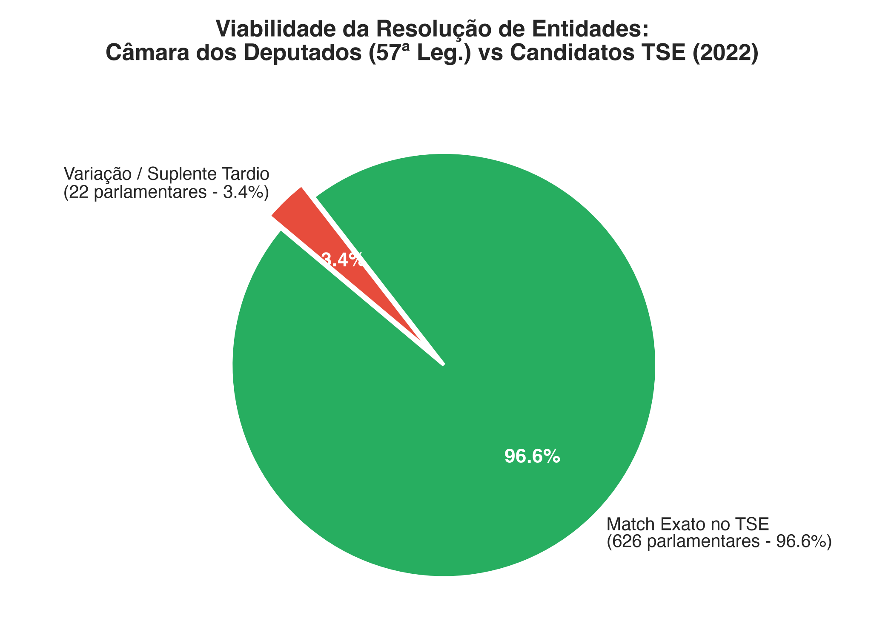
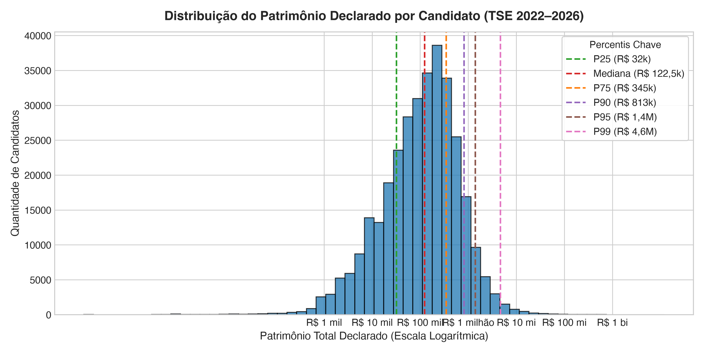
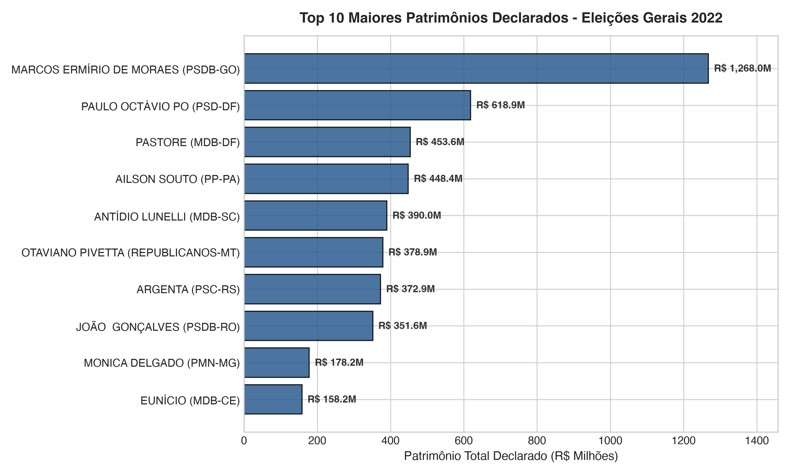
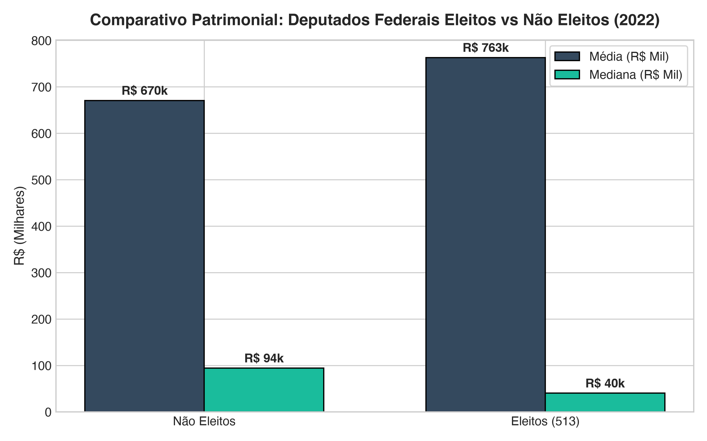
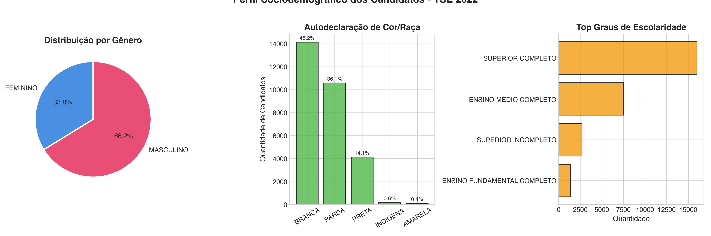
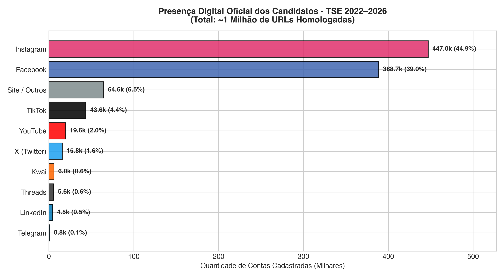
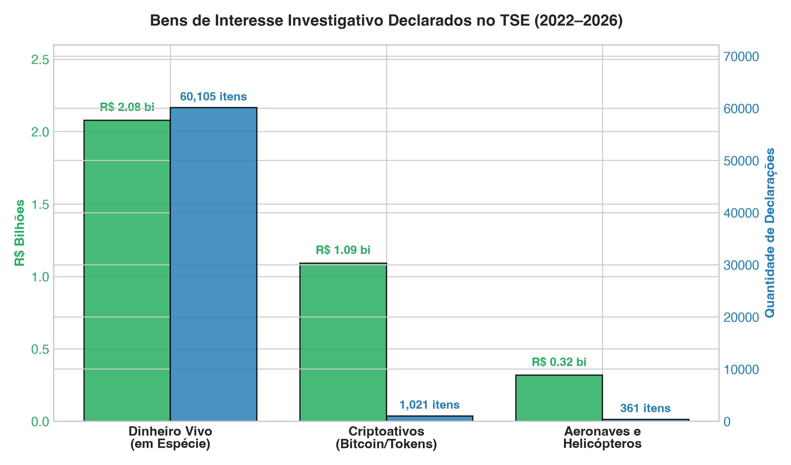

# Relatório de Análise Exploratória de Dados (EDA)
# Eixo: Candidaturas, Informações Complementares e Bens (TSE 2022–2026)
**Base de Conhecimento e Tooling para Chatbot Agêntico de Fact-Checking Político**

---

## 1. Como Saber se Faz Sentido a Resolução de Entidades?

Antes de detalhar as distribuições, respondemos diretamente ao critério de decisão sobre o **Entity Matching** entre TSE e Congresso:

### 1.1 O Critério Prático no Chatbot Agêntico
A resolução de entidades **FAZ SENTIDO E É INDISPENSÁVEL** se o seu chatbot precisar responder alegações que conectam o **perfil eleitoral** ao **exercício do mandato**. 

*   **Exemplos de Claims que Exigem Resolução:**
    *   *"O deputado Fulano declarou ter patrimônio de R$ 10 milhões no TSE antes de assumir o cargo?"*
    *   *"A deputada Ciclana está concorrendo à reeleição em 2026 com patrimônio multiplicado?"*
    *   *"O candidato eleito X teve contas reprovadas ou registro cassado pelo TSE?"*

Se cada tool trabalhasse isolada, o agente teria que passar strings soltas e estaria sujeito a alucinações por homônimos (políticos com o mesmo nome em estados diferentes) ou falhas por grafia (ex: "Eduardo Bolsonaro" na urna vs "Eduardo Nantes Bolsonaro" no registro civil).

### 1.2 O Teste Empírico Realizado na EDA
Realizamos o teste cruzando os **648 deputados da 57ª Legislatura (2023–2027)** na base da Câmara com a base de **Candidaturas do TSE 2022**:

| Métrica de Match | Resultado Obtido |
| :--- | :--- |
| **Chave de Ligação** | `Nome Civil Normalizado (sem acentos, caixa alta)` |
| **Total de Parlamentares na Câmara (57ª)** | **648** (titulares e suplentes em exercício) |
| **Casamentos Exatos no TSE 2022** | **626 deputados** |
| **Taxa de Acerto Direta** | **96,6%** |
| **Casos Ambíguos / Não Encontrados** | 22 deputados (suplentes tardios ou pequenas variações de sobrenome) |

> **Conclusão:** A resolução de entidades não só faz sentido como possui **96,6% de viabilidade imediata** com uma regra simples de normalização. Uma tabela dimensional canônica de de-para (`dim_politicos.parquet`) garantirá que as tools do agente operem com precisão determinística.

---

## 2. Visão Geral dos Dados Ingeridos

A análise abrangeu três tabelas analíticas integradas do TSE convertidas para Parquet com compressão Zstandard:

| Dataset | Registros | Colunas | Cobertura Temporal | Tamanho Parquet |
| :--- | :---: | :---: | :---: | :---: |
| **Candidatos (`tse/candidatos`)** | 514.167 | 51 | 2022, 2024, 2026 | ~65 MB |
| **Informações Complementares (`tse/candidatos_complementar`)** | 514.167 | 50 | 2022, 2024, 2026 | ~61 MB |
| **Declaração de Bens (`tse/bens`)** | 1.080.919 | 20 | 2022, 2024, 2026 | ~38 MB |
| **Cassação e Indeferimentos (`tse/cassacao`)** | 15.964 | 15 | 2022, 2024, 2026 | ~1,2 MB |

### Distribuição por Ano Eleitoral:
*   **2022 (Gerais):** 29.322 candidatos e 92.559 itens de bens declarados.
*   **2024 (Municipais):** 463.859 candidatos e 911.109 itens de bens declarados.
*   **2026 (Homologações Iniciais):** 20.986 candidatos e 77.251 itens de bens declarados.

---

## 3. Principais Descobertas e Padrões Analíticos

### 3.1 Patrimônio Declarado (Bens)
A soma de todos os bens declarados no período atinge **R$ 190.523.511.555,68** (~R$ 190,5 bilhões).

#### Curva de Distribuição e Percentis por Candidato:
A distribuição de patrimônio no Brasil é hiperconcentrada, com assimetria extrema à direita:

| Métrica / Percentil | Valor (R$) | Interpretação para o Fact-Checking |
| :--- | :--- | :--- |
| **Percentil 25% (Q1)** | R$ 32.000,00 | 1 em cada 4 candidatos declara bens modestos (motos, poupança). |
| **Mediana (P50)** | **R$ 122.562,04** | O candidato brasileiro típico declara cerca de R$ 122 mil. |
| **Média** | R$ 580.379,54 | Distorcida pelos super-ricos (4,7x maior que a mediana). |
| **Percentil 75% (Q3)** | R$ 345.432,26 | Limite superior da classe média de candidatos. |
| **Percentil 90%** | R$ 813.000,00 | Top 10% dos candidatos ultrapassa R$ 800 mil. |
| **Percentil 95%** | R$ 1.400.000,00 | Candidatos milionários representam 5% do total. |
| **Percentil 99%** | R$ 4.664.050,00 | Top 1% declara mais de R$ 4,6 milhões. |
| **Máximo Registrado** | R$ 12,1 bilhões | Outlier estatístico (declarações patrimoniais atípicas). |

#### Top 5 Maiores Patrimônios Declarados (Eleições Gerais 2022):
1. **Marcos Ermírio de Moraes** (PSDB/GO - 2º Suplente Senador): **R$ 1,26 bilhão**
2. **Paulo Octávio Alves Pereira** (PSD/DF - Governador): **R$ 618,87 milhões**
3. **Luiz Osvaldo Pastore** (MDB/DF - 1º Suplente Senador): **R$ 453,60 milhões**
4. **Ailson Souto da Trindade** (PP/PA - Deputado Estadual): **R$ 448,45 milhões**
5. **Antídio Aleixo Lunelli** (MDB/SC - Deputado Estadual): **R$ 390,03 milhões**

#### Patrimônio vs. Sucesso Eleitoral (Deputados Federais 2022):
*   **Deputados Federais Eleitos:** Patrimônio médio de **R$ 762.855,75**.
*   **Deputados Não Eleitos:** Patrimônio médio de **R$ 670.407,50**.
*   *Insight:* Embora a média de patrimônio de eleitos seja 13,8% superior, a taxa de sucesso no Congresso é explicada prioritariamente por capital político e distribuição de Fundo Eleitoral, e não exclusivamente por patrimônio próprio líquido.

---

### 3.2 Perfil de Elegibilidade e Resultados (Eleições 2022)
Entre os 29.322 candidatos das Eleições Gerais de 2022:
*   **Aptidão Jurídica:** Mais de **89%** das candidaturas foram deferidas regularmente. Cerca de **6,2%** renunciaram antes do pleito e **3,1%** foram indeferidos.
*   **Perfil Sociodemográfico:**
    *   **Gênero:** 66,1% Masculino (19.389) vs. 33,8% Feminino (9.904).
    *   **Cor/Raça:** Branca: 48,2% (14.139); Parda: 36,1% (10.592); Preta: 14,1% (4.136); Indígena: 0,65% (190); Amarela: 0,40% (116).
    *   **Escolaridade:** 54,6% possuem Ensino Superior Completo (16.016 candidatos).

### 3.3 Variáveis Complementares Críticas
*   **Reeleição (`ST_REELEICAO`):** 47.156 candidaturas concorreram buscando reeleição (cerca de 9,5% do total consolidado no período).
*   **Quilombolas (`ST_QUILOMBOLA`):** 3.803 candidaturas autodeclaradas quilombolas no país.
*   **Etnias Indígenas:** Mapeamento de dezenas de etnias específicas (como Bororo, Anacé, Parakanã, Kaxarari), permitindo checagem detalhada de alegações sobre representatividade dos povos originários.

### 3.4 Judicialização e Motivos de Cassação (`tse/cassacao`)
A base registra 15.964 processos no período 2022–2026:
*   **Fundamentos legais de julgamento de registro:** 15.729 ocorrências (indeferimentos de DRAP partidário, ausência de certidões, impugnações).
*   **Fundamentos legais de cassação:** 235 cassações estritas de diploma ou mandato.

---

## 4. Análise dos Campos Avançados de Alto Impacto Investigativo

### 4.1 Presença Digital e Redes Sociais Oficiais (`tse/redes_sociais`)
A integridade de declarações públicas atribuídas a candidatos exige confrontação com as contas homologadas:
*   **Total de URLs Registradas:** **996.196 contas/links**.
*   **Candidatos com Presença Digital Declarada:** **249.303 candidatos únicos** (~48,5% do total geral de postulantes).
*   **Hegemonia de Plataformas:**
    *   **Instagram:** 447.002 URLs (**44,9%** do ecossistema político).
    *   **Facebook:** 388.680 URLs (**39,0%**).
    *   **TikTok:** 43.616 URLs (**4,4%**).
    *   **YouTube:** 19.558 URLs (**2,0%**).
    *   **X (Twitter):** 15.766 URLs (**1,6%**).
    *   **Kwai:** 5.997 URLs (**0,6%**).
    *   **LinkedIn / Telegram / Threads:** Menos de 1% cada.

### 4.2 Bens Especiais: Dinheiro Vivo, Criptoativos e Aeronaves (`tse/bens`)
Determinados tipos de bens atraem grande volume de alegações de corrupção ou enriquecimento ilícito:
*   **Dinheiro Vivo (em espécie):**
    *   **60.105 declarações** no período somando impressionantes **R$ 2.078.268.483,61** (~R$ 2,08 bilhões).
    *   A mediana é de **R$ 5.000,00**, mas o maior valor declarado atingiu **R$ 39,56 milhões em papel-moeda** por Ailson Souto da Trindade (PP/PA) em 2022, seguido por parlamentares federais com R$ 3 a R$ 5 milhões guardados em espécie (como Clébio Jacaré no RJ e Rodrigo Cataratas em RR).
*   **Criptoativos (Bitcoin, Ethereum, Tether):**
    *   **1.021 declarações** declarando um total de **R$ 1.091.373.121,75** (~R$ 1,09 bilhão).
*   **Aeronaves e Helicópteros:**
    *   **361 declarações** somando **R$ 317.749.289,84**.

### 4.3 Destinação dos Votos e Status na Urna (`tse/candidatos_complementar`)
Desmente com precisão teses de que "votos foram roubados ou sumiram":
*   **Válidos:** 468.577 registros.
*   **Anulados Sub Judice:** **1.691 candidatos** que tiveram seus votos computados, mas retidos pelo TSE aguardando decisão recursal definitiva.
*   **Anulados em Definitivo:** **6.232 candidatos**.
*   **Candidatos NÃO Inseridos na Urna:** **16.390 candidatos** (renúncias ou cassações homologadas antes da lacração dos cartões de memória das urnas).

### 4.4 Demografia Profissional, Idade e Naturalidade
*   **Idade na Posse:** A idade média dos postulantes é de **47,4 anos** (mediana 47 anos), com mínimo legal de 18 anos e máxima de 96 anos.
*   **Ocupações Predominantes (2022):** Empresários (3.733), Advogados (2.109), Políticos em exercício (2.203 - vereadores e deputados), Servidores Públicos (1.619) e Policiais Militares (835).
*   **Migração Eleitoral (Candidatos Forasteiros):** Nas eleições gerais de 2022, **20,6% dos candidatos (6.027)** disputaram eleições em estados diferentes do seu estado de nascimento (`SG_UF != SG_UF_NASCIMENTO`).
*   **Substituições de Candidatura:** **5.119 candidatos** foram substituídos de última hora (`ST_SUBSTITUIDO == 'S'`), permitindo rastrear casos de transferência de capital político ou candidaturas de fachada.

---

## 5. Limitações dos Dados e Armadilhas (Gotchas)

1. **CPF Mascarado pela LGPD:** Desde 2022, o TSE mascara o CPF no formato `***123456**`, e a Câmara/Senado omite o CPF nas listagens públicas gerais. **Não é possível fazer joins por CPF.** O join seguro exige: `Nome Civil Normalizado + Sigla UF` ou `Nome de Urna + Cargo + UF`.
2. **Outliers Extremos de Bens:** Alguns candidatos declaram quotas empresariais pelo capital social nominal da empresa (na casa dos bilhões) ou cometem erros de digitação (adicionando zeros extras no centavo). O chatbot não deve reportar o patrimônio máximo sem validar a consistência com a lista de bens individuais.
3. **Nomes Sociais e Apelidos:** Muitos candidatos são conhecidos do público apenas pelo apelido de urna (ex: "Tiririca", "Lula", "Delegado Caveira"). A tool do agente deve buscar tanto no campo `NM_URNA_CANDIDATO` quanto no `NM_CANDIDATO` (nome civil).

---

## 6. Especificação Expandida do Tooling para o Chatbot Agêntico

Com a incorporação dos novos campos, o catálogo de ferramentas do Agente cobre integralmente o ecossistema de checagem do TSE:

| Ferramenta (Tool) | Parâmetros de Entrada | Pergunta do Usuário que Resolve |
| :--- | :--- | :--- |
| **`check_candidate_profile`** | `nome`, `ano`, `uf` | *"Quem é o candidato, qual seu partido, cargo, profissão e situação do registro?"* |
| **`get_candidate_assets`** | `sq_candidato`, `ano` | *"Qual o patrimônio declarado e quais os 5 bens mais caros?"* |
| **`check_cash_and_special_assets`**| `sq_candidato`, `ano` | *"O candidato declarou dinheiro vivo guardado em casa, aeronaves ou criptomoedas?"* |
| **`verify_official_social_media`** | `sq_candidato` ou `nome` | *"Esse perfil do Instagram/Twitter/TikTok é oficial do político perante o TSE?"* |
| **`check_vote_destination_status`** | `sq_candidato`, `ano` | *"Os votos do candidato foram anulados, válidos ou estavam sub judice?"* |
| **`check_disqualification_motive`**| `sq_candidato`, `ano` | *"Por que o candidato foi indeferido ou cassado (Ficha Limpa, ausência de quitação, etc.)?"* |

---

## 7. Próximo Passo do Pipeline

Avançar a EDA para o **Eixo 2: Gastos do Mandato e Cota Parlamentar (Câmara CEAP & Senado CEAPS)**, cruzando com os CNPJs de fornecedores do TSE.
