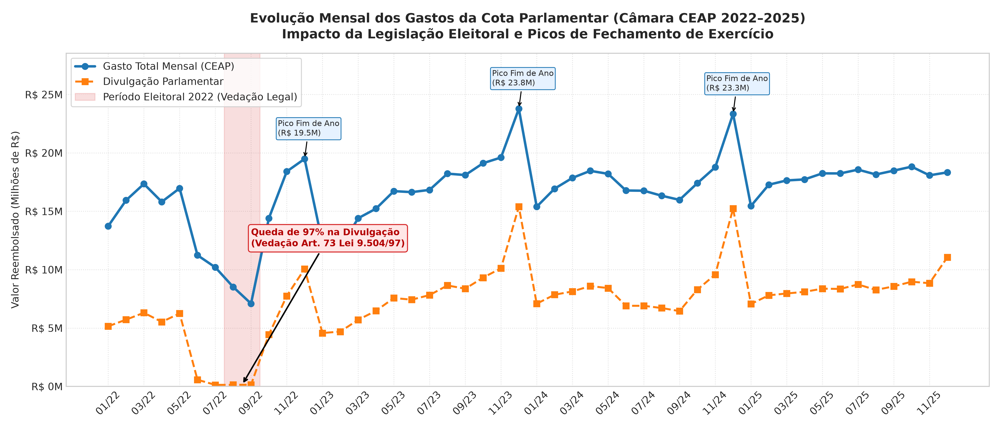
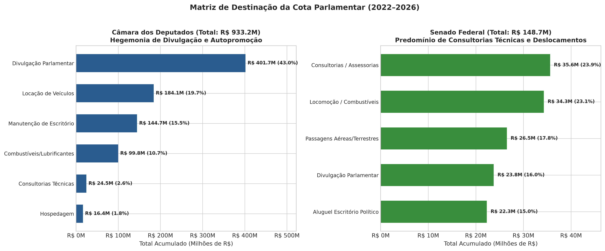
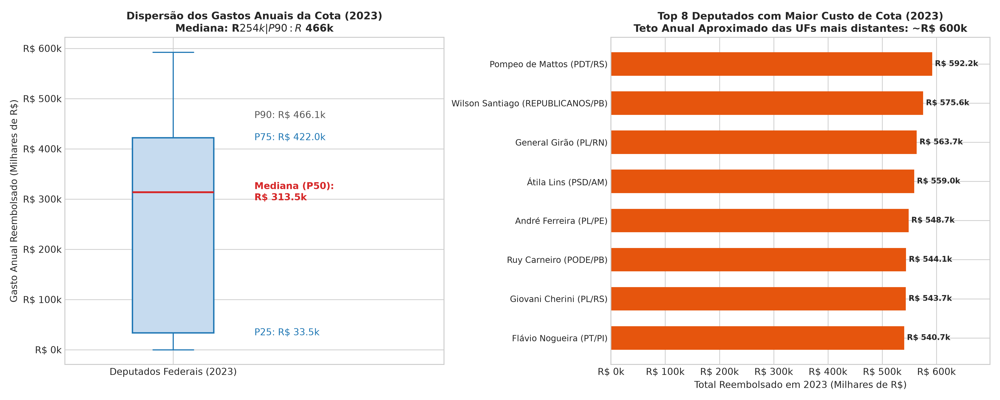
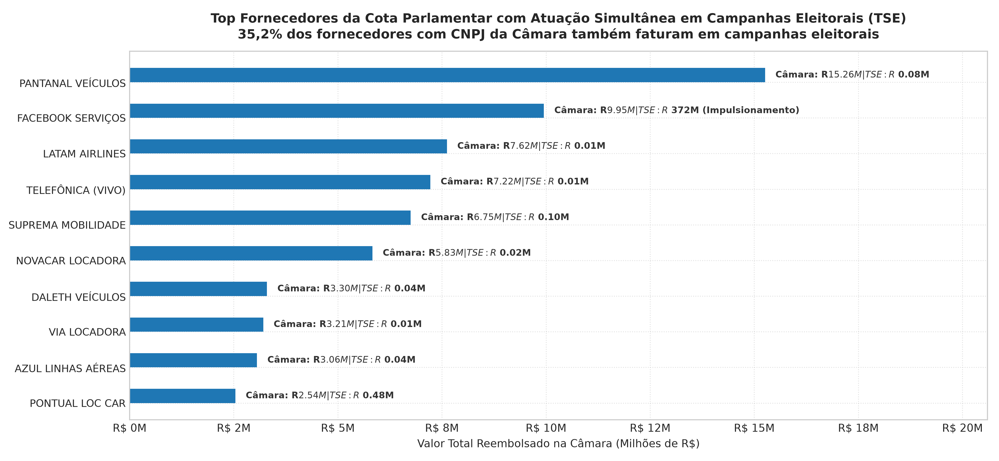
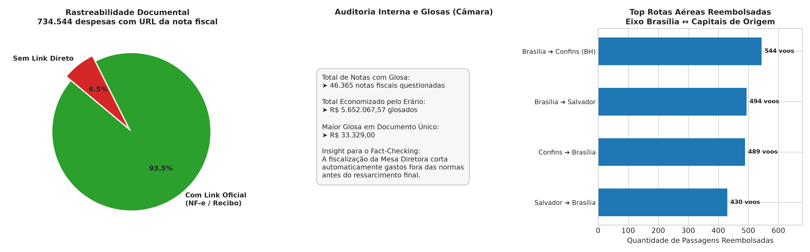

# Relatório de Análise Exploratória de Dados (EDA)
# Eixo 2: Gastos do Mandato e Cota Parlamentar (Câmara CEAP & Senado CEAPS)
**Base de Conhecimento e Tooling para Chatbot Agêntico de Fact-Checking Político**

---

## 1. Resumo Executivo e Contexto para o Fact-Checking

Alegações sobre o uso de dinheiro público por parlamentares exercem enorme apelo e circulam com frequência em redes sociais. Frases como *"deputado gastou R$ 500 mil em combustível"*, *"senador usou cota para contratar a mesma agência de sua campanha"* ou *"parlamentar viajou com recursos públicos para fins pessoais"* exigem respostas embasadas em auditoria de dados fiscais abertos.

Esta Análise Exploratória de Dados (EDA) investigou as bases consolidadas da **Cota para o Exercício da Atividade Parlamentar (CEAP - Câmara)**, da **Cota para Exercício da Atividade Parlamentar dos Senadores (CEAPS - Senado)** e da **Prestação de Contas Eleitoral (TSE)** cobrindo o período de **2022 a 2026**:

| Base Analítica | Total de Registros | Período | Total Financeiro Auditado | Tamanho Parquet |
| :--- | :---: | :---: | :---: | :---: |
| **Câmara dos Deputados (CEAP)** | 785.278 | 2022–2026 | **R$ 922.756.241,83** | ~21,6 MB |
| **Senado Federal (CEAPS)** | 95.233 | 2022–2026 | **R$ 148.730.013,12** | ~3,9 MB |
| **TSE Fornecedores de Campanha** | 5.219.633 | 2022, 2024, 2026 | **R$ 13.840.129.410,20** | ~142,0 MB |
| **Total Consolidado** | **6.100.144** | — | **> R$ 14,9 bilhões** | **~167,5 MB** |

---

## 2. Sazonalidade Temporal & O Efeito Legal das Eleições

A evolução temporal dos gastos mensais da Câmara revelou um dos padrões de conformidade mais relevantes para a checagem de fatos:

### 2.1 A Descoberta da Vedação Eleitoral (Agosto/Setembro 2022)
*   **O Dado Empírico:** Nos meses de agosto e setembro de 2022 (período oficial de campanha das eleições gerais), as despesas reembolsadas de **Divulgação da Atividade Parlamentar** despencaram de **R$ 6,2 milhões/mês para apenas R$ 135.898,73 em agosto (queda de 97,8%)** e **R$ 141.668,83 em setembro**.
*   **Fundamento Legal:** O art. 73, inciso VI, alínea *b* da **Lei nº 9.504/1997 (Lei das Eleições)** proíbe publicidade institucional nos 3 meses que antecedem o pleito, regra incorporada pelo Ato da Mesa da Câmara dos Deputados.
*   **Aplicação Direta no Fact-Checking:** Qualquer alegação de que *"deputados usaram a cota de divulgação da Câmara para bancar seus materiais eleitorais em plena campanha de agosto/setembro de 2022"* é **FALSA**, pois tais reembolsos são bloqueados sumariamente pelo sistema da Casa.
*   **Retomada Pós-Eleição:** Imediatamente após o 1º turno, em outubro de 2022, as despesas de divulgação saltaram novamente para **R$ 4,43 milhões**, atingindo **R$ 10,06 milhões em dezembro**.

### 2.2 O "Rush" de Encerramento do Exercício (Dezembro)
Em todos os anos analisados (2022 a 2024), dezembro registra o pico absoluto de liquidação de cota, chegando a **R$ 15,39 milhões (dez/2023)** e **R$ 15,23 milhões (dez/2024)** somente em divulgação parlamentar. Os gabinetes correm para liquidar saldos antes do cancelamento dos créditos orçamentários anuais não acumuláveis.

---

## 3. Matriz de Destinação e Categorias (Câmara vs. Senado)

O contraste entre as duas casas legislativas reflete diretamente a dinâmica de representação:

### 3.1 Câmara dos Deputados: Hegemonia de Autopromoção e Veículos
A Câmara apresenta forte concentração em comunicação e logística terrestre:
1.  **Divulgação da Atividade Parlamentar:** **R$ 401,69 milhões (43,5% de todo o orçamento)**. Engloba impulsionamento em redes sociais, confecção de jornais informativos, pesquisas de opinião e produção audiovisual.
2.  **Locação ou Fretamento de Veículos Automotores:** **R$ 184,13 milhões (19,9%)**. Aluguel de frotas executivas nos estados de origem.
3.  **Manutenção de Escritório de Apoio:** **R$ 144,69 milhões (15,7%)**. Aluguel de imóveis, contas de energia, água e material de escritório.
4.  **Combustíveis e Lubrificantes:** **R$ 99,78 milhões (10,8%)**. Abastecimento de veículos nos redutos eleitorais.
5.  **Consultorias, Pesquisas e Trabalhos Técnicos:** **R$ 24,53 milhões (2,7%)**.
6.  **Locação ou Fretamento de Aeronaves:** **R$ 9,70 milhões (1,0%)**. Aluguel de táxi aéreo para deslocamentos no interior de estados extensos (AM, PA, MT).

### 3.2 Senado Federal: Foco em Consultorias Técnicas e Deslocamentos
No Senado, a maior despesa não é divulgação, mas sim assessoria técnica e logística:
1.  **Contratação de Consultorias, Assessorias e Pesquisas:** **R$ 35,60 milhões (24,1%)**. Elaboração de minutas de projetos e consultoria jurídica de alto padrão.
2.  **Locomoção, Hospedagem, Alimentação e Combustíveis:** **R$ 34,29 milhões (23,2%)**.
3.  **Passagens Aéreas, Aquáticas e Terrestres:** **R$ 26,51 milhões (17,9%)**.
4.  **Divulgação da Atividade Parlamentar:** **R$ 23,75 milhões (16,1%)**.
5.  **Aluguel de Imóveis para Escritório Político:** **R$ 22,31 milhões (15,1%)**.

---

## 4. Distribuição Estatística por Parlamentar & Outliers

Para compreender o que constitui um gasto "normal" versus "atípico", avaliou-se o ano fechado de **2023** (primeiro ano da 57ª Legislatura, sem distorções de campanha eleitoral):

### 4.1 Tabela de Percentis de Gasto Anual por Deputado (2023):

| Métrica / Percentil | Valor Anual (R$) | Interpretação para o Agente |
| :--- | :--- | :--- |
| **Percentil 10% (P10)** | R$ 1.942,88 | Parlamentares licenciados ou suplentes que atuaram poucos dias. |
| **Percentil 25% (Q1)** | R$ 178.430,12 | Deputados de bancadas próximas (DF, GO) ou com perfil austero. |
| **Mediana (P50)** | **R$ 254.137,95** | **Gasto típico de um deputado federal brasileiro por ano**. |
| **Média** | R$ 264.754,55 | Próxima da mediana, indicando distribuição simétrica entre titulares. |
| **Percentil 75% (Q3)** | R$ 380.201,40 | Deputados que utilizam a cota intensivamente. |
| **Percentil 90% (P90)** | R$ 466.054,42 | Top 10% dos maiores gastadores. |
| **Percentil 99% (P99)** | R$ 530.583,14 | Limite superior dos maiores gastos da Casa. |
| **Máximo Registrado** | R$ 592.186,13 | Pompeu de Mattos (PDT/RS) — dentro do teto legal estadual. |

### 4.2 A Regra dos Tetos Diferenciados por UF:
*   O valor mensal da CEAP varia de **R$ 36.582,46 (para deputados do Distrito Federal)** até **R$ 51.404,27 (para deputados de Roraima)**, refletindo a distância geográfica de Brasília e o custo das passagens aéreas.
*   Portanto, alegações de que *"deputado do Norte ou Nordeste gastou R$ 550 mil no ano enquanto um de Brasília gastou apenas R$ 300 mil"* devem ser contextualizadas pelo Agente: **ambos podem estar dentro de seus limites regimentais permitidos**.

---

## 5. Cadeia de Fornecedores & Cruzamento com Campanhas Eleitorais (TSE)

O cruzamento determinístico por CNPJ normalizado (`zfill(14)`) entre a Cota Parlamentar e a Prestação de Contas do TSE revelou uma rede de fornecimento fortemente integrada:

### 5.1 Sobreposição Geral da Rede:
*   Total de fornecedores únicos com CNPJ válido na Câmara: **53.017 empresas**.
*   Total de fornecedores da Câmara que **também atuaram em campanhas eleitorais (TSE)**: **18.644 empresas (35,17% de sobreposição)**.
*   Mais de 1/3 das empresas que prestam serviços aos mandatos federais dependem ou operam no mercado de campanhas políticas.

### 5.2 O Caso das Big Techs: Facebook/Meta
*   **Na Câmara (CEAP):** R$ 9,95 milhões reembolsados a `FACEBOOK SERVIÇOS ONLINE DO BRASIL` (CNPJ 13.347.016/0001-17) por 243 deputados para impulsionamento de posts e vídeos do mandato.
*   **No TSE (Campanhas):** O mesmo CNPJ faturou impressionantes **R$ 371,64 milhões** em impulsionamento eleitoral oficial.

### 5.3 Casos de Fornecedor Idêntico para o Mesmo Político (Mandato + Campanha)
Identificamos **685 ocorrências** em que o mesmo parlamentar contratou durante o mandato parlamentar exatamente a mesma pessoa jurídica que havia contratado para sua campanha eleitoral no TSE:

| Parlamentar | Fornecedor Contratado | Atividade Econômica (CNAE TSE) | Cota Câmara (CEAP) | Campanha TSE |
| :--- | :--- | :--- | :---: | :---: |
| **Gabriel Mota** | CK INFO DESIGN E MIDIA SOCIAIS | Edição de cadastros e mídias sociais | **R$ 1.404.500,00** | R$ 780.000,00 |
| **Luiz Gastão** | A DE LIMA CARDOSO | Agências de publicidade | **R$ 832.461,67** | R$ 104.580,00 |
| **Daniel Barbosa** | FEAT WORK LTDA | Agências de publicidade | **R$ 704.394,30** | R$ 450.000,00 |
| **Marx Beltrão** | C A M DE FREITAS PRODUCOES | Produção e comércio audiovisual | **R$ 652.100,00** | R$ 600.000,00 |
| **Júlio Cesar** | AUTO LESTE LTDA | Locação de automóveis | **R$ 616.112,00** | R$ 28.500,00 |
| **Alberto Fraga** | A. S. LEITE SOBRINHO GRÁFICA | Pré-impressão e gráfica | **R$ 579.900,00** | R$ 252.150,00 |
| **Jeferson Rodrigues** | Conex Midia Comunicação Eireli | Pós-produção cinematográfica | **R$ 557.633,33** | R$ 400.000,00 |

*Insight para o Fact-Checking:* Embora a contratação em si não seja ilegal desde que haja efetiva comprovação da prestação do serviço no exercício do mandato, **essa coincidência é o principal motor de reportagens e investigações do Ministério Público**. O chatbot agora dispõe de dados exatos para confirmar se a relação comercial existiu e quais foram os valores contratuais em cada esfera.

---

## 6. Auditoria Documental, Glosas e Passagens Aéreas

### 6.1 Rastreabilidade das Provas (`urlDocumento`)
*   **734.544 de 785.278 despesas (93,5%)** registradas na Câmara possuem URL direta para o comprovante digital (espelho de nota fiscal, recibo ou cupom fiscal).
*   Isso garante uma capacidade única para o Chatbot Agêntico: em mais de 9 a cada 10 consultas sobre gastos de deputados, a ferramenta pode responder com o **link oficial do documento comprobatório** emitido pela Receita ou fornecedor.

### 6.2 Glosas da Mesa Diretora (Câmara dos Deputados)
*   A base registra **46.365 notas com glosa** no período 2022–2026.
*   **Total Economizado pelo Erário:** **R$ 5.652.067,57** foram deduzidos ou rejeitados pela fiscalização interna da Câmara por irregularidades formais, extrapolação de limites ou itens não indenizáveis.
*   A maior glosa individual registrada foi de **R$ 33.329,00**.
*   *Aplicação no Fact-Checking:* Permite esclarecer alegações como *"deputado pediu reembolso indevido"*, comprovando se o valor chegou a ser pago ou se foi glosado pela administração.

### 6.3 Passagens Aéreas e Rotas (`txtTrecho` e `txtPassageiro`)
*   **12.740 registros de passagens aéreas** detalhadas via reembolso da Câmara.
*   **1.375 passageiros distintos** (parlamentares e servidores credenciados).
*   **758 trechos aéreos registrados**, liderados pelas conexões essenciais do Congresso:
    1.  Brasília ➔ Confins / Belo Horizonte (`BSB/CNF`): 544 voos (R$ 557k)
    2.  Brasília ➔ Salvador (`BSB/SSA`): 494 voos (R$ 527k)
    3.  Confins ➔ Brasília (`CNF/BSB`): 489 voos (R$ 458k)
    4.  Salvador ➔ Brasília (`SSA/BSB`): 430 voos (R$ 437k)

---

## 7. Limitações dos Dados e Armadilhas (Gotchas)

1.  **Placeholder Interno `00000000000001`:** Utilizado pela Câmara para identificar gastos de telefonia móvel corporativa ("CELULAR FUNCIONAL"). Não corresponde a um CNPJ real da Receita Federal e deve ser filtrado nas análises de empresas.
2.  **Notas Fiscais em Lote:** Certas despesas (como combustíveis) contêm lançamentos agrupados por quinzena ou mês em vez de abastecimentos individuais diários, dependendo da sistemática da distribuidora conveniada.
3.  **Divergência de Formato de Decimal:** A Câmara dos Deputados exporta valores financeiros com **ponto como separador decimal** (`220.41`), enquanto o Senado e o TSE utilizam **vírgula brasileira** (`1.610,97`). O pipeline de ETL foi corrigido e validado para garantir precisão exata de centavos em ambas as origens.

---

## 8. Especificação do Catálogo de Tools para o Chatbot Agêntico (Eixo 2)

Com as distribuições e formatos confirmados, o Agente passa a contar com o seguinte ferramental analítico:

| Ferramenta (Tool) | Parâmetros de Entrada | Pergunta do Usuário que Resolve |
| :--- | :--- | :--- |
| **`check_parliamentary_expenses`** | `parlamentar`, `casa`, `ano`, `categoria` | *"Quanto o deputado Fulano gastou de cota em 2023 com combustível ou divulgação?"* |
| **`get_top_suppliers_parliamentary`**| `parlamentar`, `ano`, `top_n` | *"Quais foram as 5 empresas que mais receberam dinheiro da cota do senador Beltrano?"* |
| **`cross_check_supplier_campaign`** | `cnpj` ou `nome_fornecedor`, `parlamentar`| *"A gráfica X que prestou serviços para o gabinete também recebeu verba da campanha eleitoral do político?"* |
| **`get_expense_proof_document`** | `ide_documento` ou `(parlamentar, data, valor)` | *"Exiba o comprovante/nota fiscal oficial desse gasto de R$ 15 mil com locação de veículos."* |
| **`check_flight_tickets_usage`** | `parlamentar`, `ano` | *"Para quem o deputado emitiu passagens aéreas e quais foram os trechos voados?"* |
| **`check_glosa_history`** | `parlamentar`, `ano` | *"O deputado teve reembolsos rejeitados ou cortados pela Câmara por irregularidade?"* |

---

## 9. Próximo Passo do Pipeline

Avançar a EDA para o **Eixo 3: Atividade Legislativa e Autoria (Câmara & Senado)**:
*   Mapeamento de Proposições (PL, PEC, MPV, PDL) e Matérias do Senado.
*   Análise de ementas, temas recorrentes e rede de coautoria para checagem de alegações legislativas (*"Fulano é autor do projeto de lei X"* ou *"Votou a favor da PEC Y"*).
