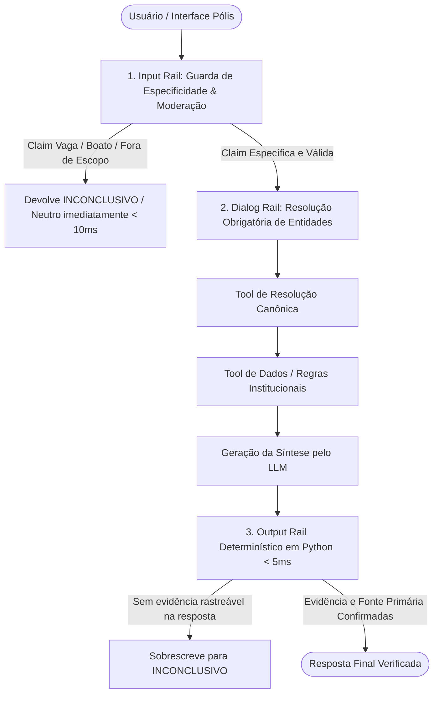

# Plano de Implementação: NeMo Guardrails para o Agente de Fact-Checking

- **Documento:** `docs/plan_guardrails.md`
- **Projeto:** Fact-Checking Político Brasileiro (CBL - Grupo 13)
- **Objetivo:** Blindagem formal das 10 regras inegociáveis de [`AGENTS.md`](file:///Users/aluno2/Documents/challenge1-grupo13/AGENTS.md) com baixa latência (< 3s total, < 5ms no output rail).
- **Status:** Proposto para execução

---

## 1. Visão Geral e Justificativa Arquitetural

O **NeMo Guardrails** (NVIDIA) atuará como a camada de mediação programática entre o usuário, o LLM e o catálogo de ferramentas oficiais do sistema.

Para evitar o problema de degradação de desempenho apontado na discussão de arquitetura, o pipeline adotará a **estratégia híbrida assíncrona**:
1. **Input Rails semânticos/heurísticos:** cortam imediatamente prompts maliciosos, off-topic ou claims vagas **antes** de chamar o LLM ou o banco de dados (economizando latência e tokens).
2. **Dialog Rails:** governam a ordem das chamadas de ferramentas (garantindo resolução canônica de entidade antes de consultas de dados).
3. **Output Rails determinísticos em Python:** executam em **menos de 5 milissegundos** via código nativo, auditando se a resposta gerada contém a citação literal da fonte primária retornada pelas tools.



---

## 2. Matriz de Cobertura das Regras Constitucionais

| Regra da Constituição | Rail Responsável | Mecanismo de Imposição | Latência Estimada |
| :--- | :--- | :--- | :--- |
| **Regra 1: Nenhum veredito sem evidência** | Output Rail | Action Python intercepta e verifica se `tool_executed == True` e se a fonte oficial consta no texto gerado. Se ausente, reescreve para `INCONCLUSIVO`. | `< 2ms` |
| **Regra 2: Resolução prévia de entidade** | Dialog Rail | Fluxo Colang impede o acionamento de tools transacionais com strings livres de nomes ou proposições. | `0ms` (lógica de fluxo) |
| **Regra 3: Subespecificação gera Inconclusivo** | Input Rail | Detecta ausência de entidade nominada ou menção a boatos de redes sociais ("estão dizendo", "ouvi falar"), devolvendo `INCONCLUSIVO` sem chamar LLM. | `< 15ms` |
| **Regra 4: Separação transacional vs institucional** | Dialog Rail | Roteia claims sobre "o que é permitido" exclusivamente para `check_institutional_rule`. | `0ms` (roteamento) |
| **Regra 5: Golden Dataset como portão de aceite** | CI / Testes | Suíte de validação executada contra as 30 claims de `golden_dataset_v1.json`. | Fase de Testes |
| **Regra 6: Neutralidade de veredito** | Input + Output | Input bloqueia pedidos de opinião pessoal; Output valida tom técnico e impessoal. | `< 5ms` |

---

## 3. Estrutura de Arquivos no Projeto

```text
src/guardrails/
├── __init__.py
├── config/
│   ├── config.yml              # Configuração geral de modelos e ativação dos rails
│   ├── prompts.yml             # Instruções de sistema e autocorreção
│   └── flows/
│       ├── input_specificity.co  # Input Rails: Guarda de Especificidade (Regra 3)
│       ├── input_moderation.co   # Input Rails: Neutralidade e Off-topic (Regra 6)
│       ├── dialog_routing.co     # Dialog Rails: Resolução e Tools (Regras 2 e 4)
│       └── output_evidence.co    # Output Rails: Rastreabilidade (Regras 1 e 6)
├── actions.py                  # Python Actions que chamam as tools existentes
└── service.py                  # Wrapper assíncrono para injeção na API FastAPI
tests/
├── test_guardrails_input.py    # Testes unitários dos Input Rails
├── test_guardrails_output.py   # Testes unitários dos Output Rails determinísticos
└── test_guardrails_e2e.py      # Testes integrados com o Golden Dataset
```

---

## 4. Fases de Execução (Ciclo TDD e Commits)

### Fase 1: Configuração do Ambiente e Dependências
- **Ações:**
  - Adicionar `nemoguardrails>=0.11.0` ao `requirements.txt`.
  - Configurar carregamento de modelos locais (`Ollama`) ou remotos (`Groq`) compatíveis com a arquitetura existente em `src/core/llm_client.py`.
- **Commit:** `chore(guardrails): adiciona dependencias do nemo guardrails`

---

### Fase 2: TDD dos Input Rails (Especificidade e Moderação)
- **Metodologia:**
  1. *Etapa RED:* Escrever testes em `tests/test_guardrails_input.py` que falham ao enviar:
     - Boatos de redes sociais ("Nas redes sociais dizem que um deputado gastou muito").
     - Perguntas sem entidade ou data ancorável ("Ele roubou recentemente?").
     - Perguntas de opinião pessoal ("Qual é o melhor partido político?").
  2. *Etapa GREEN:* Implementar `input_specificity.co` e `input_moderation.co` no NeMo Guardrails para interceptar as entradas e devolver `INCONCLUSIVO` / resposta neutra sem acionar LLM.
- **Commits:**
  - `test(guardrails): adiciona testes unitarios para input rails`
  - `feat(guardrails): implementa input rails de especificidade e moderacao`

---

### Fase 3: TDD dos Output Rails Determinísticos (Evidência Rastreável)
- **Metodologia:**
  1. *Etapa RED:* Escrever testes em `tests/test_guardrails_output.py` forçando cenários onde o LLM tenta devolver `VERDADEIRO` ou `FALSO` sem que uma tool tenha sido executada ou sem citar a fonte da tool.
  2. *Etapa GREEN:* Implementar action Python em `src/guardrails/actions.py` (`check_evidence_source`) que faz a validação determinística de string/metadados em `< 2ms`, reescrevendo para `INCONCLUSIVO` caso a fonte oficial não seja localizada no texto gerado.
- **Commits:**
  - `test(guardrails): adiciona testes unitarios para output rails deterministas`
  - `feat(guardrails): implementa output rails com auditoria de evidencia em python`

---

### Fase 4: Integração à API FastAPI e Validação no Golden Dataset
- **Metodologia:**
  1. Criar `src/guardrails/service.py` expondo o pipeline blindado.
  2. Integrar o serviço ao endpoint `POST /api/check` em `src/api/routes/factcheck.py`.
  3. Rodar os 30 casos de teste de `golden_dataset_v1.json` garantindo que os vereditos `VERDADEIRO`, `FALSO` e `INCONCLUSIVO` batem com a especificação sem quebra de contrato.
  4. Executar medição de latência garantindo tempo médio inferior a 3.0s.
- **Commits:**
  - `feat(guardrails): conecta nemo guardrails a api fastapi`
  - `test(golden-dataset): valida aceitacao das 30 claims com guardrails ativos`

---

## 5. Critérios de Aceite e Portão de Qualidade

1. **Zero Veredito Sem Fonte (Regra 1):** Em 100% dos testes, nenhuma resposta com `VERDADEIRO` ou `FALSO` é emitida sem conter o nome da fonte primária (Ato da Mesa, CF/88, Regimento, TSE ou Portal da Transparência).
2. **Bloqueio Antecipado de Boatos e Claims Vagas (Regra 3):** 100% das 6 claims subespecificadas do Golden Dataset (IDs 25 a 30) são interceptadas no Input Rail em menos de 15ms, sem chamar LLM desnecessariamente.
3. **Latência do Output Rail:** Tempo de execução do Output Rail medido estritamente abaixo de 5 milissegundos via auditoria nativa em Python.
4. **Cobertura e Mocks (Regra 8):** 100% dos testes do pytest aprovados sem dependência de chamadas externas de rede em runtime de teste.

