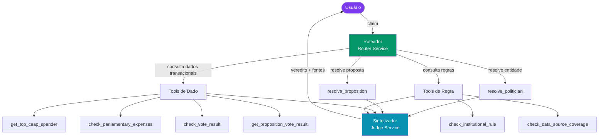
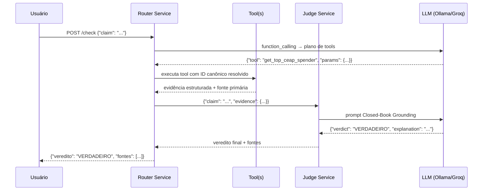

# Arquitetura do Sistema

## Visão macro

O Factcheck Agent é construído como um **sistema multiagente em pipeline**, com separação clara entre:

- **Aquisição de dados** (ETL, scraping, APIs oficiais)
- **Resolução de entidades** (quem é o político? qual é a proposição?)
- **Execução de tools** (consultas a dados reais, validação de regras)
- **Orquestração e síntese** (roteador → sintetizador → veredito)
- **Exposição** (API REST, frontend)

---

## Princípios arquiteturais (Constituição do Projeto)

Estes princípios são **inegociáveis** e estão codificados no [`AGENTS.md`](https://github.com/yanrdgs-dev/challenge1-grupo13/blob/main/AGENTS.md):

!!! important "Princípio I — Nenhum veredito sem evidência rastreável"
    Todo veredito final precisa citar o resultado de uma tool específica e a fonte primária correspondente. Se nenhuma tool retornou evidência suficiente, o veredito é `INCONCLUSIVO`.

!!! important "Princípio II — Resolução de entidade obrigatória"
    Nenhuma tool de dado pode ser chamada com nome de parlamentar em texto livre. A entidade precisa primeiro passar pela `resolve_politician` ou `resolve_proposition`.

!!! important "Princípio III — Claims subespecificadas → INCONCLUSIVO"
    Se a alegação não nomeia uma entidade resolvível, usa referência temporal não ancorável ou cita fonte de baixa credibilidade (redes sociais, boatos), o agente retorna `INCONCLUSIVO` sem forçar correspondência.

!!! important "Princípio IV — Separação dado transacional / regra institucional"
    Tools que consultam dados reais (gastos, votos) são separadas de tools que consultam regras e normas (`check_institutional_rule`).

!!! note "Princípio V — Golden Dataset como portão de aceite"
    Nenhuma tool é considerada pronta sem passar nas 30 alegações de `golden_dataset_v1.json`.

!!! note "Princípio VI — Neutralidade de veredito"
    O agente não tem viés de confirmação em nenhuma direção.

!!! warning "Princípio VII — TDD é obrigatório"
    Ciclo red → green → refactor. Nenhum código sem teste correspondente anterior.

---

## Camadas técnicas

| Camada | Tecnologia | Módulo |
|---|---|---|
| **Inferência LLM** | Ollama (local), Groq, OpenAI (nuvem) | `src/core/llm_client.py` |
| **Orquestração** | FastAPI + httpx | `src/services/router_service.py` |
| **Síntese / Julgamento** | FastAPI + httpx | `src/services/judge_service.py` |
| **Consulta analítica** | DuckDB + Parquet | `src/database/duckdb_client.py` |
| **ETL / Ingestão local** | Polars + PyArrow | `src/etl/build_parquet.py` |
| **Scraping de portais** | requests + BeautifulSoup | `src/ingestion/extractors.py` |
| **Extração de notícias** | trafilatura | `src/services/url_scraper.py` |
| **Fuzzy matching** | RapidFuzz | `src/tools/normalizer.py` |
| **Containerização** | Docker + Kubernetes | `docker/`, `k8s/` |

---

## Fluxo de uma checagem completa

