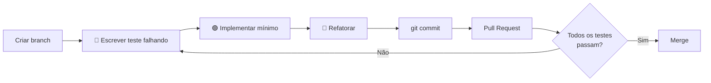

# Contribuindo

## Pré-requisitos

- Python **3.11+**
- [`uv`](https://docs.astral.sh/uv/) (package manager)
- Ollama instalado localmente (ou chave Groq para contingência)

---

## Setup inicial

```bash
# 1. Clonar o repositório
git clone https://github.com/yanrdgs-dev/challenge1-grupo13.git
cd challenge1-grupo13

# 2. Criar ambiente virtual e instalar dependências
uv sync            # produção + dev
uv sync --group eda  # + pandas/matplotlib para análise exploratória

# 3. Configurar variáveis de ambiente
cp .env.example .env
# Edite .env com suas credenciais

# 4. Verificar instalação
uv run pytest
```

---

## Fluxo de trabalho (TDD obrigatório)



---

## Padrão de branches

| Prefixo | Uso |
|---|---|
| `feat/` | Nova feature ou tool |
| `fix/` | Correção de bug |
| `docs/` | Documentação |
| `test/` | Somente testes (sem código novo) |
| `refactor/` | Refatoração sem nova funcionalidade |
| `chore/` | Dependências, configs, CI |

---

## Padrão de commits (Conventional Commits)

```bash
feat(tools): adiciona resolve_politician
fix(ingestion): trata AttributeValueList e tags sem href
test(scraper): adiciona suite de testes para url_scraper
docs(mkdocs): adiciona documentacao por etapas do pipeline
refactor(etl): extrai funcao clean_currency_series
chore(deps): adiciona trafilatura como dependencia
```

O escopo entre parênteses indica o **módulo afetado**: `tools`, `etl`, `ingestion`, `agentes`, `api`, `infra`, `docs`.

---

## Antes de abrir um Pull Request

- [ ] Todos os testes da suíte passam: `uv run pytest`
- [ ] Novo código possui testes correspondentes (TDD)
- [ ] Tools novas cobrem os 4 cenários obrigatórios (caminho feliz, não encontrado, ambíguo, erro de rede)
- [ ] Commits seguem o padrão Conventional Commits
- [ ] Nenhuma chamada real de API em testes unitários (usar mocks)
- [ ] Pull request referencia a Issue correspondente (`Closes #NNN`)

---

## Estrutura de uma nova tool

```python
# src/tools/minha_tool.py
"""Descrição da tool e referência à seção da spec."""

def minha_tool(param: str) -> dict:
    """
    Docstring: o que faz, quando usar, retorno.
    """
    # 1. Validar parâmetros
    # 2. Consultar dado (local/Parquet ou API)
    # 3. Retornar estrutura com fonte primária
    return {
        "resultado": ...,
        "fonte": "Portal da Transparência — ...",
    }
```

```python
# tests/test_minha_tool.py — ESCREVER PRIMEIRO (TDD)
def test_minha_tool_caminho_feliz():
    ...

def test_minha_tool_nao_encontrado():
    ...

def test_minha_tool_erro_de_rede():
    with patch("requests.get", side_effect=ConnectionError()):
        ...
```

---

## Adicionar documentação MkDocs

```bash
# Criar nova página
echo "# Minha Página" > site-docs/minha-pagina.md

# Adicionar ao nav em mkdocs.yml
# Visualizar localmente
uv run mkdocs serve
# Acesse: http://127.0.0.1:8000

# Build estático
uv run mkdocs build
```
