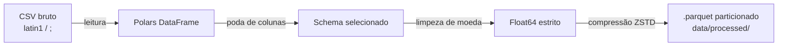

# Etapa 2 — Pipeline ETL e Conversão para Parquet

## Objetivo

Ingerir os CSVs brutos do TSE e da Câmara, aplicar limpeza tipada estrita e serializá-los em arquivos `.parquet` com compressão **ZSTD** e particionamento por ano eleitoral para consulta analítica local via DuckDB.

**Issues:** [#3 — 1.2 Pipeline ETL](https://github.com/yanrdgs-dev/challenge1-grupo13/issues/3) ✅ | [#4 — 1.3 DuckDB](https://github.com/yanrdgs-dev/challenge1-grupo13/issues/4) ✅

---

## Componentes

| Arquivo | Responsabilidade |
|---|---|
| [`src/etl/build_parquet.py`](https://github.com/yanrdgs-dev/challenge1-grupo13/blob/main/src/etl/build_parquet.py) | Script CLI: CSV bruto → `.parquet` com Polars |
| [`src/etl/build_dim_politicos.py`](https://github.com/yanrdgs-dev/challenge1-grupo13/blob/main/src/etl/build_dim_politicos.py) | Gera a dimensão canônica de políticos (`dim_politicos.parquet`) |
| [`src/database/duckdb_client.py`](https://github.com/yanrdgs-dev/challenge1-grupo13/blob/main/src/database/duckdb_client.py) | Camada de acesso analítico (read-only + globbing) |

---

## Pipeline de ETL (`build_parquet.py`)



### Uso via CLI

```bash
# Processar todas as despesas do TSE
uv run python -m src.etl.build_parquet \
    --input data/raw/tse/despesas/ \
    --output data/processed/despesas/ \
    --min-reduction 70.0

# Processando com schema específico
uv run python -m src.etl.build_parquet \
    --input data/raw/tse/bens/ \
    --output data/processed/bens/ \
    --schema tse_bens \
    --min-reduction 0.0
```

### Transformações aplicadas

!!! note "Moeda brasileira → Float64"
    `VR_PAGTO_DESPESA` nos CSVs do TSE vem como string com vírgula decimal e ponto separador de milhar (ex: `"1.234,56"`). O ETL aplica substituição e cast estrito para `Float64`.

```python
def clean_currency_series(series: pl.Series) -> pl.Series:
    """Higieniza e converte formato moeda BR para Float64."""
    return (
        series.cast(pl.Utf8)
        .str.strip_chars()
        .str.replace_all(r"\.", "")   # remove ponto separador de milhar
        .str.replace(",", ".")        # vírgula → ponto decimal
        .cast(pl.Float64, strict=True)
    )
```

---

## Camada DuckDB (`duckdb_client.py`)

A `DuckDBClient` opera em **modo somente leitura** sobre os arquivos Parquet gerados pelo ETL, expondo consultas parametrizadas seguras contra SQL Injection.

```python
from src.database.duckdb_client import DuckDBClient

client = DuckDBClient()  # lê data/processed/**/*.parquet

# Consulta parametrizada
resultados = client.query(
    "SELECT nome_parlamentar, SUM(valor) AS total FROM ceap WHERE ano = ? GROUP BY 1 ORDER BY 2 DESC LIMIT 5",
    params=[2023],
)
```

### Modos de operação

| Modo | Uso | Comportamento |
|---|---|---|
| `":memory:"` | Testes unitários | Banco efêmero em RAM, aceita escrita |
| `path/to/file.duckdb` | Produção | Read-only por padrão |

### Globbing de múltiplos Parquets

```python
# Registra uma view sobre todos os arquivos particionados
client.register_parquet_view(
    view_name="ceap",
    glob_pattern="data/processed/ceap/**/*.parquet"
)
```

---

## Dimensão Canônica de Políticos

O script `build_dim_politicos.py` unifica registros do TSE, da Câmara e do Senado numa tabela dimensional única usada pela `resolve_politician`:

```
dim_politicos.parquet
├── sq_candidato       (TSE)
├── ideCadastro        (Câmara dos Deputados)
├── cod_senador        (Senado Federal)
├── nome_civil
├── nome_urna
├── nome_normalizado   (sem acento, caixa baixa — chave de join)
├── uf
├── partido
└── cargo
```

---

## Testes

```bash
uv run pytest tests/test_build_parquet.py       # 19+ testes ETL
uv run pytest tests/test_duckdb_queries.py      # 10 testes analíticos
uv run pytest tests/test_build_dim_politicos.py # testes da dimensão
```
