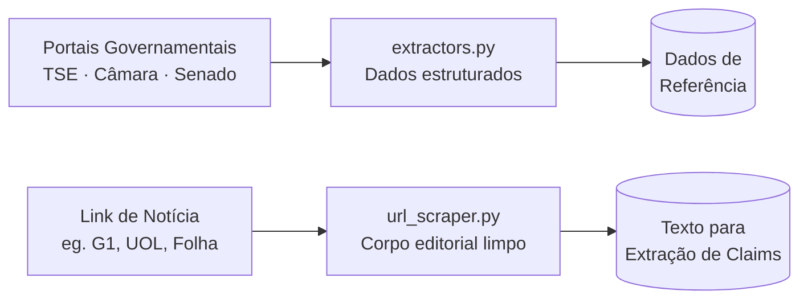

# Etapa 3 — Ingestão Web e Extração de Notícias

## Objetivo

Coletar dados estruturados dos portais de dados abertos governamentais e extrair o texto limpo de matérias jornalísticas reais a partir de URLs fornecidas pelo usuário.

**Issues:** [#23 — Task 4.1 Scraping de Artigos](https://github.com/yanrdgs-dev/challenge1-grupo13/issues/23) ✅ (branch `feat/webscraping`)

---

## Dois módulos distintos



---

## Módulo 1 — Scraping de Portais (`extractors.py`)

**Arquivo:** [`src/ingestion/extractors.py`](https://github.com/yanrdgs-dev/challenge1-grupo13/blob/feat/webscraping/src/ingestion/extractors.py)

Realiza scraping e download estruturado dos portais de **Dados Abertos** governamentais para mapear conjuntos de dados disponíveis.

### Funções disponíveis

=== "Câmara dos Deputados"

    ```python
    from src.ingestion.extractors import scrape_dados_abertos_camara

    dados = scrape_dados_abertos_camara(limit=20)
    # Retorna lista de dicionários com:
    # id_fonte, casa, tipo, numero, ano, texto_ementa, url
    ```

    Consulta a API REST `https://dadosabertos.camara.leg.br/api/v2/proposicoes` e retorna proposições legislativas com ementa e metadados.

=== "Senado Federal"

    ```python
    from src.ingestion.extractors import scrape_dados_abertos_senado

    dados = scrape_dados_abertos_senado(limit=20)
    # Retorna lista com:
    # id_fonte, casa, tipo, numero, ano, texto_ementa, url
    ```

    Consulta `https://legis.senado.leg.br/dadosabertos/materia/atualizadas` e retorna matérias legislativas atualizadas.

=== "TSE"

    ```python
    from src.ingestion.extractors import scrape_dados_abertos_tse

    dados = scrape_dados_abertos_tse()
    # Retorna lista com:
    # id_fonte, fonte, titulo_conjunto, url_conjunto
    ```

    Faz scraping HTML do portal CKAN `https://dadosabertos.tse.jus.br/dataset` para mapear os conjuntos de dados disponíveis.

### Tratamento de atributos multivalorados do BeautifulSoup

!!! warning "Detalhe de implementação — `AttributeValueList`"
    Em BeautifulSoup 4.15+, `Tag.__getitem__("href")` pode retornar `str` **ou** `AttributeValueList` (uma lista). O módulo trata isso explicitamente com narrowing de tipo:

    ```python
    a_tag = title_elem.find("a")
    href = a_tag.get("href") if a_tag else ""
    if isinstance(href, str):
        link = href
    elif isinstance(href, list) and href:
        link = href[0]
    else:
        link = ""
    ```

---

## Módulo 2 — Extrator de Notícias (`url_scraper.py`)

**Arquivo:** [`src/services/url_scraper.py`](https://github.com/yanrdgs-dev/challenge1-grupo13/blob/feat/webscraping/src/services/url_scraper.py)

Extrai o corpo editorial limpo de **qualquer URL de notícia** usando [`trafilatura`](https://trafilatura.readthedocs.io/), removendo menus de navegação, rodapés, publicidade e scripts.

### Uso

```python
from src.services.url_scraper import extract_article

resultado = extract_article("https://g1.globo.com/politica/noticia/reforma.html")

print(resultado["success"])       # True
print(resultado["title"])         # "Câmara aprova reforma tributária"
print(resultado["author"])        # "Redação Política"
print(resultado["publish_date"])  # "2026-10-08"
print(resultado["clean_text"])    # Corpo da matéria sem anúncios
```

### Estrutura de retorno

```python
{
    "success": bool,          # True se extração bem-sucedida
    "error_type": str | None, # "INVALID_URL" | "PAYWALL_OR_FORBIDDEN" |
                              # "NOT_FOUND" | "HTTP_ERROR" |
                              # "NETWORK_ERROR" | "EMPTY_CONTENT" | None
    "message": str,           # Descrição do resultado
    "title": str | None,      # Título extraído
    "author": str | None,     # Autor(es)
    "publish_date": str | None, # Data de publicação (YYYY-MM-DD)
    "clean_text": str,        # Corpo editorial limpo
    "url": str,               # URL original fornecida
}
```

### Cenários tratados

| Situação | `success` | `error_type` |
|---|---|---|
| Extração bem-sucedida | `True` | `None` |
| URL malformada | `False` | `INVALID_URL` |
| Paywall / HTTP 403 | `False` | `PAYWALL_OR_FORBIDDEN` |
| Página não encontrada / HTTP 404 | `False` | `NOT_FOUND` |
| Outros erros HTTP (500, etc.) | `False` | `HTTP_ERROR` |
| Falha de DNS ou timeout | `False` | `NETWORK_ERROR` |
| HTML sem conteúdo extraível (JS-only) | `False` | `EMPTY_CONTENT` |

---

## Testes

```bash
# 7 testes dos extratores governamentais
uv run pytest tests/test_extractors.py

# 9 testes do extrator de notícias
uv run pytest tests/test_url_scraper.py
```

!!! note "100% mockado"
    Todos os testes usam `unittest.mock.patch("requests.get", ...)` — nenhuma chamada real de rede é feita nos testes unitários.
