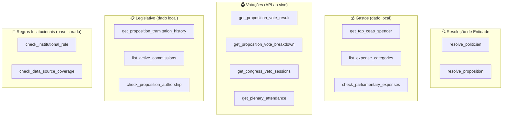

# Etapa 4 — Catálogo de Tools

## Objetivo

As **tools** são funções Python determinísticas que consultam dados factuais oficiais ou regras institucionais. Cada veredito emitido pelo agente **precisa** citar o resultado de pelo menos uma tool com fonte primária rastreável.

!!! important "Princípio II — Resolução de entidade obrigatória"
    Nenhuma tool de dado transacional pode ser chamada diretamente com nome de parlamentar em texto livre. A entidade **deve** ser resolvida primeiro por `resolve_politician` ou `resolve_proposition`.

---

## Organização das tools



---

## Grupo 1 — Resolução de Entidade

### `resolve_politician`
**Arquivo:** [`src/tools/resolve_politician.py`](https://github.com/yanrdgs-dev/challenge1-grupo13/blob/main/src/tools/resolve_politician.py) ✅

Resolve nomes populares, apelidos e variações ortográficas para o registro canônico da dimensão de políticos.

```python
from src.tools.resolve_politician import resolve_politician

resultado = resolve_politician(nome_busca="Pompeo de Mattos", uf="RS")
# {
#     "ideCadastro": 73486,
#     "nome_urna": "POMPEO DE MATTOS",
#     "partido": "PDT",
#     "uf": "RS",
#     "ambiguous": False,
#     "match_score": 97.3
# }
```

| Parâmetro | Tipo | Obrigatório | Descrição |
|---|---|---|---|
| `nome_busca` | `str` | ✅ | Nome civil, de urna ou apelido |
| `uf` | `str` | ❌ | Sigla da UF (desambigua homônimos) |
| `cargo` | `str` | ❌ | `"Deputado Federal"` \| `"Senador"` |
| `ano` | `int` | ❌ | Ano/legislatura de referência |

**Testes:** [`tests/test_resolve_politician.py`](https://github.com/yanrdgs-dev/challenge1-grupo13/blob/main/tests/test_resolve_politician.py) (20 testes)

---

### `resolve_proposition`
**Arquivo:** [`src/tools/resolve_proposition.py`](https://github.com/yanrdgs-dev/challenge1-grupo13/blob/main/src/tools/resolve_proposition.py) ✅

Resolve proposições mencionadas na alegação para o ID canônico da Câmara ou Senado, via API com cache.

```python
from src.tools.resolve_proposition import resolve_proposition

resultado = resolve_proposition(
    casa="camara",
    sigla_tipo="PL",
    numero=2630,
    ano=2020
)
# {"id_proposicao": 2256735, "ementa": "Lei Brasileira de Liberdade...", ...}
```

**Testes:** [`tests/test_resolve_proposition.py`](https://github.com/yanrdgs-dev/challenge1-grupo13/blob/main/tests/test_resolve_proposition.py) (10 testes)

---

## Grupo 2 — Gastos (dado local)

**Arquivo:** [`src/tools/gastos_tools.py`](https://github.com/yanrdgs-dev/challenge1-grupo13/blob/main/src/tools/gastos_tools.py) ✅

Opera sobre arquivos Parquet locais via Polars. **Sem chamada de rede.**

### `get_top_ceap_spender`

Retorna o parlamentar com maior gasto acumulado da cota parlamentar (CEAP/CEAPS) num dado ano.

```python
from src.tools.gastos_tools import get_top_ceap_spender

resultado = get_top_ceap_spender(casa="camara", ano=2023, top_n=1)
# {"nome_parlamentar": "POMPEO DE MATTOS", "total_gasto": 177842.13, ...}
```

### `list_expense_categories`

Lista as categorias de gasto permitidas pela cota parlamentar.

```python
from src.tools.gastos_tools import list_expense_categories

categorias = list_expense_categories(casa="camara")
# ["Passagens aéreas", "Hospedagem", "Combustíveis", ...]
```

### `check_parliamentary_expenses`

Verifica o gasto de um parlamentar específico por categoria.

```python
from src.tools.gastos_tools import check_parliamentary_expenses

gasto = check_parliamentary_expenses(
    nome_parlamentar="POMPEO DE MATTOS",
    casa="camara",
    ano=2023,
    categoria="Passagens aéreas"
)
```

**Testes:** [`tests/test_gastos_tools.py`](https://github.com/yanrdgs-dev/challenge1-grupo13/blob/main/tests/test_gastos_tools.py)

---

## Grupo 3 — Votações (API ao vivo)

**Arquivo:** [`src/tools/votacoes_api.py`](https://github.com/yanrdgs-dev/challenge1-grupo13/blob/main/src/tools/votacoes_api.py) ✅

Consulta as APIs de Dados Abertos da Câmara e do Senado em tempo real, com **cache de sessão em memória** e **retry automático** via `HttpClient`.

| Tool | Descrição |
|---|---|
| `get_proposition_vote_result` | Resultado de votação (aprovado / rejeitado) de uma proposição |
| `get_proposition_vote_breakdown` | Detalhamento de votos nominais (por parlamentar) |
| `get_congress_veto_sessions` | Sessões de apreciação de vetos presidenciais |
| `get_plenary_attendance` | Frequência de parlamentar em sessões plenárias |

**Testes:** [`tests/test_votacoes_tools.py`](https://github.com/yanrdgs-dev/challenge1-grupo13/blob/main/tests/test_votacoes_tools.py)

---

## Grupo 4 — Legislativo (dado local)

**Arquivo:** [`src/tools/legislativo_tools.py`](https://github.com/yanrdgs-dev/challenge1-grupo13/blob/main/src/tools/legislativo_tools.py) ✅

Analisa dados de tramitação de proposições a partir de Parquet local.

| Tool | Descrição |
|---|---|
| `get_proposition_tramitation_history` | Histórico de tramitação de uma proposição |
| `list_active_commissions` | Comissões temáticas ativas |
| `check_proposition_authorship` | Autoria de uma proposição |

**Testes:** [`tests/test_legislativo_tools.py`](https://github.com/yanrdgs-dev/challenge1-grupo13/blob/main/tests/test_legislativo_tools.py)

---

## Grupo 5 — Regras Institucionais (base curada)

**Arquivo:** [`src/tools/knowledge_tools.py`](https://github.com/yanrdgs-dev/challenge1-grupo13/blob/main/src/tools/knowledge_tools.py) ✅

Consulta bases de conhecimento normativo curadas manualmente, codificadas em JSON. **Sem chamada de rede.**

### `check_institutional_rule`

```python
from src.tools.knowledge_tools import check_institutional_rule

regra = check_institutional_rule(topico="sabatina_stf")
# {
#     "resposta_resumida": "A aprovação de indicados a ministro do STF é por votação secreta.",
#     "fonte_normativa": "CF/1988, art. 52, III, 'a'; RISF, art. 383",
#     "veredito_regra": "votacao_secreta"
# }
```

**Tópicos disponíveis:**

| Tópico | Descrição |
|---|---|
| `sabatina_stf` | Votação secreta para confirmação de ministros do STF |
| `calculo_cota_por_uf` | Cota parlamentar varia por UF do deputado |
| `votacao_simbolica` | Câmara pode aprovar por votação simbólica |
| `teto_categoria_combustivel` | Limite mensal (não anual) para combustíveis |
| `prestacao_contas_partido` | Obrigação anual de prestação de contas ao TSE |
| `veto_presidencial` | Apreciação de vetos em sessão conjunta do Congresso |

**Testes:** [`tests/test_knowledge_tools.py`](https://github.com/yanrdgs-dev/challenge1-grupo13/blob/main/tests/test_knowledge_tools.py)
