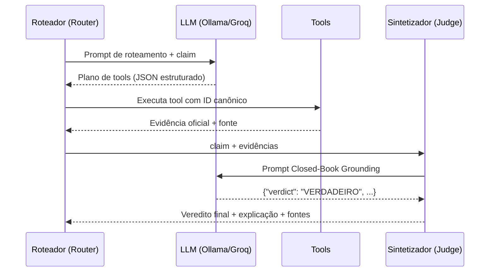

# Etapa 5 — Agentes LLM

## Objetivo

Os **agentes** são os componentes de inteligência artificial do sistema. Eles recebem as alegações em linguagem natural, planejam quais tools chamar, executam e sintetizam os resultados num veredito fundamentado.

---

## Arquitetura dos agentes



---

## Cliente LLM (`llm_client.py`)

**Arquivo:** [`src/core/llm_client.py`](https://github.com/yanrdgs-dev/challenge1-grupo13/blob/main/src/core/llm_client.py)

Interface unificada e desacoplada que permite chavear transparentemente entre provedores de inferência via variáveis de ambiente.

### Provedores suportados

| Provedor | Variável `LLM_PROVIDER` | Modelos recomendados |
|---|---|---|
| **Ollama** (local) | `ollama` | `qwen2.5:7b`, `llama3.1:8b` |
| **Groq** (nuvem — contingência) | `groq` | `llama-3.1-8b-instant` |
| **OpenAI** (nuvem — opcional) | `openai` | `gpt-4o-mini` |

### Configuração via `.env`

```bash
# .env
LLM_PROVIDER=ollama
FALLBACK_PROVIDER=groq
LLM_TIMEOUT=3.0

OLLAMA_BASE_URL=http://localhost:11434
OLLAMA_MODEL=llama3.1:8b

GROQ_API_KEY=gsk_...
GROQ_MODEL=llama-3.1-8b-instant
```

### Uso

```python
from src.core.llm_client import LLMClient

llm = LLMClient()  # usa LLM_PROVIDER do .env

resposta = llm.generate(
    prompt="Verifique a alegação...",
    system="Você é um agente de fact-checking...",
)
print(resposta)  # str com o conteúdo gerado
```

**Testes:** [`tests/test_llm_client.py`](https://github.com/yanrdgs-dev/challenge1-grupo13/blob/main/tests/test_llm_client.py) (12 testes — 100% mockados)

---

## Agente Roteador

**Arquivo:** [`src/services/router_service.py`](https://github.com/yanrdgs-dev/challenge1-grupo13/blob/main/src/services/router_service.py)

O Roteador é a porta de entrada do sistema. Utiliza **function calling** com um modelo leve (7B) para determinar qual tool usar sem executar lógica de julgamento.

### Responsabilidades

1. Receber a `claim` do usuário.
2. Invocar o LLM com o catálogo de tools disponíveis.
3. Executar a tool selecionada com o ID canônico resolvido.
4. Encaminhar a evidência ao Sintetizador.

### Prompt do sistema

O Roteador usa um prompt rígido que instrui o LLM a:

- Retornar **`INCONCLUSIVO` imediatamente** se a claim for vaga, subespecificada ou de fonte não verificável.
- Escolher **exatamente uma tool** por vez com os parâmetros corretos.
- Nunca inventar IDs ou parâmetros — se a entidade não for resolvível, sinalizar.

---

## Agente Sintetizador (Judge)

**Arquivo:** [`src/services/judge_service.py`](https://github.com/yanrdgs-dev/challenge1-grupo13/blob/main/src/services/judge_service.py)

O Sintetizador recebe a `claim` original + as evidências estruturadas das tools e emite o veredito final usando um **Closed-Book Grounding Prompt** — o LLM é explicitamente proibido de usar conhecimento externo.

### Prompt Closed-Book

```
Você é o Agente Sintetizador de Fact-Checking Político Brasileiro.
Emita o veredito baseando-se ESTRITAMENTE nas evidências apresentadas.

REGRAS:
- Nunca use conhecimento externo ou memória do modelo.
- Se as evidências forem vazias ou contraditórias: INCONCLUSIVO.
- Cite obrigatoriamente a fonte primária numérica ou normativa.

FORMATO OBRIGATÓRIO (JSON):
{
    "verdict": "VERDADEIRO" | "FALSO" | "INCONCLUSIVO",
    "confidence": "ALTA" | "MÉDIA" | "BAIXA",
    "explanation": "Frase curta com a evidência citada.",
    "sources_cited": ["Câmara dos Deputados — CEAP 2023", ...]
}
```

### Resultado de benchmark

O Sintetizador foi avaliado contra o **Golden Dataset v1** (30 alegações):

| Categoria | Total | Corretos | Acurácia |
|---|---|---|---|
| GASTOS | 18 | 18 | **100%** |
| VOTAÇÕES | 12 | 10 | **83%** |
| **Total** | **30** | **28** | **93,3%** |

---

## Normalização de entidades (`normalizer.py`)

**Arquivo:** [`src/tools/normalizer.py`](https://github.com/yanrdgs-dev/challenge1-grupo13/blob/main/src/tools/normalizer.py)

Utilitário de normalização de texto usado por `resolve_politician` e outras tools para remoção de acentos, caixa e caracteres especiais antes do matching.

```python
from src.tools.normalizer import normalize_text

normalize_text("João da SILVA")  # "joao da silva"
normalize_text("Câmara")        # "camara"
```

**Testes:** [`tests/test_normalizer.py`](https://github.com/yanrdgs-dev/challenge1-grupo13/blob/main/tests/test_normalizer.py) (7 testes)
