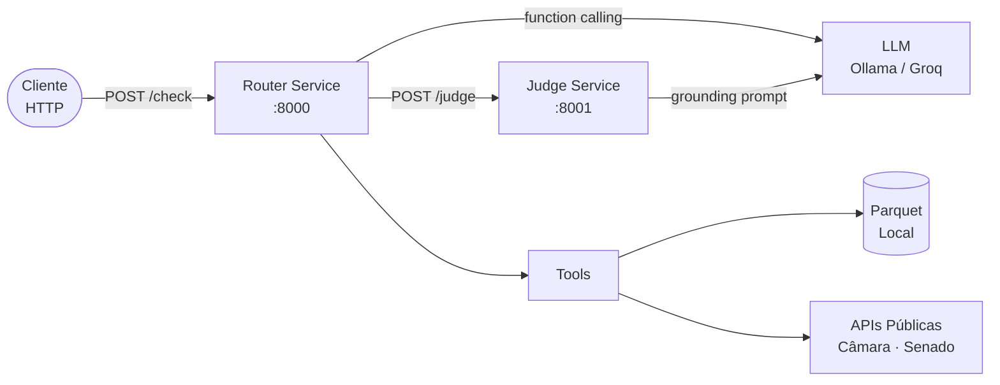

# Etapa 6 — API & Serviços REST

## Objetivo

Expor o pipeline de fact-checking como serviço HTTP via **FastAPI**, com dois microsserviços independentes que se comunicam via HTTP interno.

---

## Arquitetura de microsserviços



---

## Router Service

**Arquivo:** [`src/services/router_service.py`](https://github.com/yanrdgs-dev/challenge1-grupo13/blob/main/src/services/router_service.py)

### Iniciar

```bash
uv run uvicorn src.services.router_service:app --reload --port 8000
# Docs interativas: http://localhost:8000/docs
```

### Endpoint principal

```
POST /check
```

**Corpo da requisição:**

```json
{
    "claim": "Em 2023, o deputado que mais gastou a cota parlamentar foi Pompeo de Mattos."
}
```

**Resposta:**

```json
{
    "claim": "Em 2023...",
    "veredito": "VERDADEIRO",
    "confianca": "ALTA",
    "justificativa": "Os dados do Portal da Transparência confirmam que Pompeo de Mattos (PDT-RS) liderou o ranking CEAP em 2023 com R$ 177.842,13.",
    "fontes_primarias": ["Portal da Transparência — CEAP 2023"],
    "tool_utilizada": "get_top_ceap_spender",
    "tempo_total_ms": 1234.5
}
```

---

## Judge Service

**Arquivo:** [`src/services/judge_service.py`](https://github.com/yanrdgs-dev/challenge1-grupo13/blob/main/src/services/judge_service.py)

Serviço isolado de síntese. Recebe claim + evidências e emite veredito fundamentado via LLM.

### Iniciar

```bash
uv run uvicorn src.services.judge_service:app --reload --port 8001
# Docs interativas: http://localhost:8001/docs
```

### Endpoint

```
POST /judge
```

**Corpo:**

```json
{
    "claim": "...",
    "evidence": {"nome_parlamentar": "POMPEO DE MATTOS", "total_gasto": 177842.13},
    "tool_used": "get_top_ceap_spender"
}
```

---

## Subir ambos com Docker Compose

```bash
# Subir os dois serviços
docker compose up -d

# Verificar logs
docker compose logs -f

# Testar
curl -X POST http://localhost:8000/check \
     -H "Content-Type: application/json" \
     -d '{"claim": "Pompeo de Mattos foi o deputado com maior gasto da CEAP em 2023."}'
```

---

## Variáveis de ambiente

| Variável | Padrão | Descrição |
|---|---|---|
| `LLM_PROVIDER` | `ollama` | Provedor de LLM: `ollama` \| `groq` \| `openai` |
| `OLLAMA_BASE_URL` | `http://localhost:11434` | Endpoint do servidor Ollama |
| `ROUTER_MODEL` | `qwen2.5:7b` | Modelo leve para roteamento |
| `JUDGE_MODEL` | `qwen2.5:14b` | Modelo pesado para síntese |
| `JUDGE_SERVICE_URL` | `http://judge-service:8000` | URL interna do Judge |
| `GROQ_API_KEY` | _(vazio)_ | Chave de API Groq (contingência) |
| `LLM_TIMEOUT` | `3.0` | Timeout de inferência em segundos |

---

## Clientes HTTP especializados

### `HttpClient` — Votações e APIs externas

**Arquivo:** [`src/tools/http_client.py`](https://github.com/yanrdgs-dev/challenge1-grupo13/blob/main/src/tools/http_client.py)

- Timeout estrito configurável (padrão: 10s)
- Retry automático com backoff (até 3 tentativas)
- Cache de sessão em memória para evitar chamadas duplicadas

### `LegislativeClient` — Proposições

**Arquivo:** [`src/tools/legislative_client.py`](https://github.com/yanrdgs-dev/challenge1-grupo13/blob/main/src/tools/legislative_client.py)

- Especializado para as APIs da Câmara e do Senado
- Timeout estrito de 5s
- Cache de sessão de proposições já consultadas

**Testes:** [`tests/test_legislative_client.py`](https://github.com/yanrdgs-dev/challenge1-grupo13/blob/main/tests/test_legislative_client.py) (7 testes)
