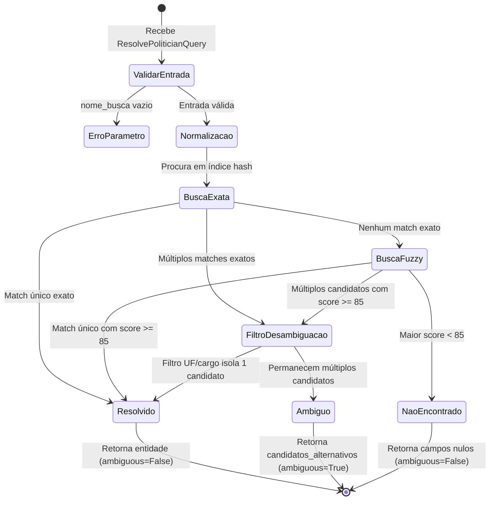

# Data Model: Resolução Canônica de Parlamentares (`resolve_politician`)

**Feature**: `001-resolve-politician`  
**Data**: 2026-10-01  
**Status**: Concluído  

---

## 1. Entidades Principais

### 1.1 `PoliticianCanonicalRecord` (Registro Canônico na Tabela Dimensional)
Representa um parlamentar federal unificado no arquivo `data/processed/dim_politicos.parquet`.

| Campo | Tipo Python | Nullable | Descrição / Regra de Negócio |
|---|---|---|---|
| `sq_candidato` | `int` | Sim | Sequencial único do candidato no TSE (eleições 2022/2026). Nulo se parlamentar não possuir registro no TSE local. |
| `ideCadastro` | `int` | Sim | Identificador numérico oficial na Câmara dos Deputados. Nulo para senadores que nunca foram deputados. |
| `cod_senador` | `int` | Sim | Identificador numérico oficial no Senado Federal. Nulo para deputados que nunca foram senadores. |
| `nome_civil` | `str` | Não | Nome civil completo em maiúsculas (conforme cadastro oficial). |
| `nome_urna` | `str` | Não | Nome eleitoral ou nome parlamentar público utilizado na urna e no plenário. |
| `nome_normalizado` | `str` | Não | Nome sem acentuação, caracteres especiais em caixa baixa para indexação rápida. |
| `casa` | `str` | Não | `"Câmara dos Deputados"` ou `"Senado Federal"`. |
| `cargo` | `str` | Não | `"Deputado Federal"` ou `"Senador"`. |
| `uf` | `str` | Não | Sigla da Unidade Federativa de representação (2 caracteres, ex.: `'SP'`, `'RS'`). |
| `partido` | `str` | Não | Sigla da legenda partidária oficial mais recente (ex.: `'PL'`, `'PT'`, `'PDT'`). |
| `mandato_anos` | `List[int]` | Sim | Lista de anos de legislatura em que o mandato esteve ativo. |

*Restrição Constitucional (Princípio II):* Sob nenhuma circunstância o campo `cpf` é armazenado, consultado ou exposto nesta entidade.

---

### 1.2 `ResolvePoliticianQuery` (Parâmetros de Entrada da Tool)
Contrato de entrada enviado pelo Agente Roteador ou Agente Sintetizador.

| Campo | Tipo | Obrigatório | Validações e Regras |
|---|---|---|---|
| `nome_busca` | `str` | Sim | Não pode ser vazio ou conter apenas espaços em branco. Mínimo 2 caracteres. |
| `uf` | `str` | Não | Sigla de UF com 2 caracteres maiúsculos (ex.: `'MG'`, `'RJ'`). Utilizada como filtro estrito de desambiguação. |
| `cargo` | `str` | Não | Deve ser exatamente `"Deputado Federal"` ou `"Senador"` se informado. |
| `ano` | `int` | Não | Ano do mandato ou pleito de referência (ex.: `2022`, `2023`). |

---

### 1.3 `ResolvePoliticianResponse` (Estrutura de Retorno da Tool)
Dicionário padronizado retornado pela função `resolve_politician`.

| Campo | Tipo | Nullable | Descrição |
|---|---|---|---|
| `sq_candidato` | `int` | Sim | ID eleitoral do TSE (preenchido se resolvido com sucesso). |
| `ideCadastro` | `int` | Sim | ID da Câmara dos Deputados (preenchido se resolvido para deputado). |
| `cod_senador` | `int` | Sim | ID do Senado Federal (preenchido se resolvido para senador). |
| `nome_civil` | `str` | Sim | Nome civil completo do político resolvido. |
| `nome_urna` | `str` | Sim | Nome de urna / nome parlamentar do político resolvido. |
| `casa` | `str` | Sim | Casa legislativa correspondente. |
| `uf` | `str` | Sim | Sigla do estado federativo. |
| `partido` | `str` | Sim | Sigla partidária. |
| `ambiguous` | `bool` | Não | `True` se múltiplos candidatos viáveis empataram sem desambiguação; caso contrário `False`. |
| `candidatos_alternativos` | `List[Dict]` | Não | Lista contendo resumos das entidades concorrentes quando `ambiguous == True`. Vazia se `ambiguous == False`. |
| `match_score` | `float` | Sim | Grau de confiança do casamento (0.0 a 100.0). |

---

## 2. Estados de Resolução e Transições

O fluxo de processamento transita deterministicamente entre três estados possíveis:

### Critérios de Decisão de Estado:

1. **Estado `Resolvido` (`ambiguous: False`):**
   - Um único candidato atinge score $\ge 85$ (ou match exato);
   - OU múltiplos candidatos atingiram score viável, mas a aplicação dos filtros `uf` ou `cargo` resultou em um único registro remanescente.
   - Retorno: campos preenchidos com os dados do parlamentar.

2. **Estado `Ambíguo` (`ambiguous: True`):**
   - Dois ou mais candidatos atingiram score viável com diferença de pontuação $\le 3\%$;
   - E nenhum parâmetro discriminador (`uf` ou `cargo`) foi capaz de isolar um único registro.
   - Retorno: campos cadastrais nulos (`None`), `candidatos_alternativos` com a lista dos concorrentes.

3. **Estado `Não Encontrado` (`ambiguous: False`):**
   - Nenhum registro na base dimensional atinge o limiar mínimo de similaridade ($85\%$).
   - Retorno: todos os campos cadastrais como `None`, `ambiguous: False`, `candidatos_alternativos: []`.
