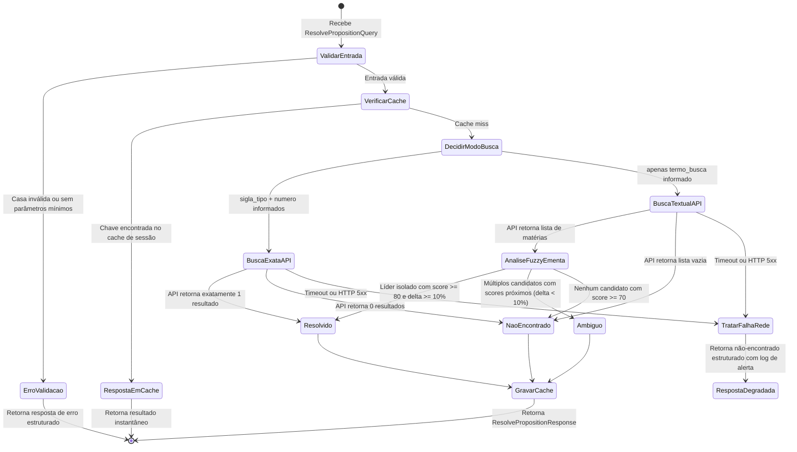

# Data Model: Resolução Canônica de Proposições (`resolve_proposition`)

**Feature**: `002-resolve-proposition`  
**Data**: 2026-10-01  
**Status**: Concluído  

---

## 1. Entidades Principais

### 1.1 `ResolvePropositionQuery` (Parâmetros de Entrada da Tool)
Contrato de entrada enviado pelo Agente Roteador.

| Campo | Tipo | Obrigatório | Descrição / Regra de Negócio |
|---|---|---|---|
| `casa` | `str` | Sim | Casa legislativa a ser consultada: `"camara"`, `"senado"` ou `"congresso"`. Valores insensíveis a maiúsculas/minúsculas. |
| `sigla_tipo` | `str` | Não | Sigla do tipo da proposição (ex.: `'PL'`, `'PEC'`, `'MPV'`, `'PDL'`). Normalizada para maiúsculas e sem pontos. |
| `numero` | `int` | Não | Número sequencial oficial da matéria legislativa (ex.: `2630`, `45`). Deve ser positivo. |
| `ano` | `int` | Não | Ano oficial de apresentação da matéria (ex.: `2019`, `2020`, `2023`). |
| `termo_busca` | `str` | Não | Texto livre contendo nome popular, apelido ou tema da matéria (ex.: `'PL das Fake News'`, `'Marco Temporal'`, `'segurança pública'`). |

*Regra de Validação:* Pelo menos um conjunto discriminador deve ser fornecido: ou (`sigla_tipo` e `numero`) ou (`termo_busca`).

---

### 1.2 `PropositionCandidateSummary` (Resumo de Candidato Concorrente)
Item contido na lista `candidatos` quando a busca identifica alternativas ou retorna ambiguidade.

| Campo | Tipo | Nullable | Descrição |
|---|---|---|---|
| `id_proposicao` | `int` | Não | Identificador numérico oficial no portal de dados abertos da Casa. |
| `sigla_tipo` | `str` | Não | Sigla oficial da matéria (ex.: `'PL'`). |
| `numero` | `int` | Não | Número oficial da matéria (ex.: `2630`). |
| `ano` | `int` | Não | Ano oficial da matéria (ex.: `2020`). |
| `ementa` | `str` | Não | Texto descritivo da ementa oficial. |
| `casa` | `str` | Não | Casa legislativa de origem (`"camara"`, `"senado"` ou `"congresso"`). |

---

### 1.3 `ResolvePropositionResponse` (Estrutura de Retorno da Tool)
Dicionário padronizado retornado pela função `resolve_proposition`.

| Campo | Tipo | Nullable | Descrição |
|---|---|---|---|
| `id_proposicao` | `int` | Sim | Identificador único oficial da matéria (preenchido quando `ambiguous == False` e resolvido com sucesso). |
| `sigla_tipo` | `str` | Sim | Sigla do tipo formal da proposição. |
| `numero` | `int` | Sim | Número oficial da matéria. |
| `ano` | `int` | Sim | Ano oficial da matéria. |
| `ementa` | `str` | Sim | Ementa completa oficial. |
| `casa` | `str` | Não | Casa legislativa consultada. |
| `ambiguous` | `bool` | Não | `True` se a busca textual resultou em múltiplos concorrentes sem desambiguação; caso contrário `False`. |
| `candidatos` | `List[Dict]` | Não | Lista contendo instâncias de `PropositionCandidateSummary` encontradas. |
| `match_score` | `float` | Sim | Grau percentual de confiança na correspondência (0.0 a 100.0). |

---

## 2. Diagrama de Estados e Regras de Transição

### Regras de Transição:

1. **Estado `Resolvido` (`ambiguous: False`):**
   - Na busca exata: A API da Câmara/Senado retorna a matéria específica.
   - Na busca textual: Uma única proposição se destaca na análise semântica da ementa (score $\ge 80$ e $\Delta \ge 10\%$).
   - *Ação:* Preenche `id_proposicao`, ementa e identificadores oficiais; `candidatos` fica vazio.

2. **Estado `Ambíguo` (`ambiguous: True`):**
   - A busca textual retorna temas genéricos ou concorrentes com proximidade semântica ($\Delta < 10\%$).
   - *Ação:* Define `id_proposicao: None` e popula a lista `candidatos` com os resumos dos concorrentes. O Agente Roteador usa este sinal para declarar a claim como `INCONCLUSIVO` (Princípio III da Constituição).

3. **Estado `Não Encontrado` (`ambiguous: False`):**
   - A matéria inexiste nos registros oficiais ou nenhum resultado atinge o limiar mínimo de similaridade ($70\%$).
   - *Ação:* Define `id_proposicao: None`, `ementa: None`, `candidatos: []`.

4. **Estado `Tratamento de Falha de Rede`:**
   - Em caso de timeout ($> 5s$) ou indisponibilidade temporária (HTTP 502/503), o cliente intercepta o erro e retorna uma resposta limpa de falha/não-encontrado estruturado, garantindo 0% de quebras no pipeline (Princípio VIII).
